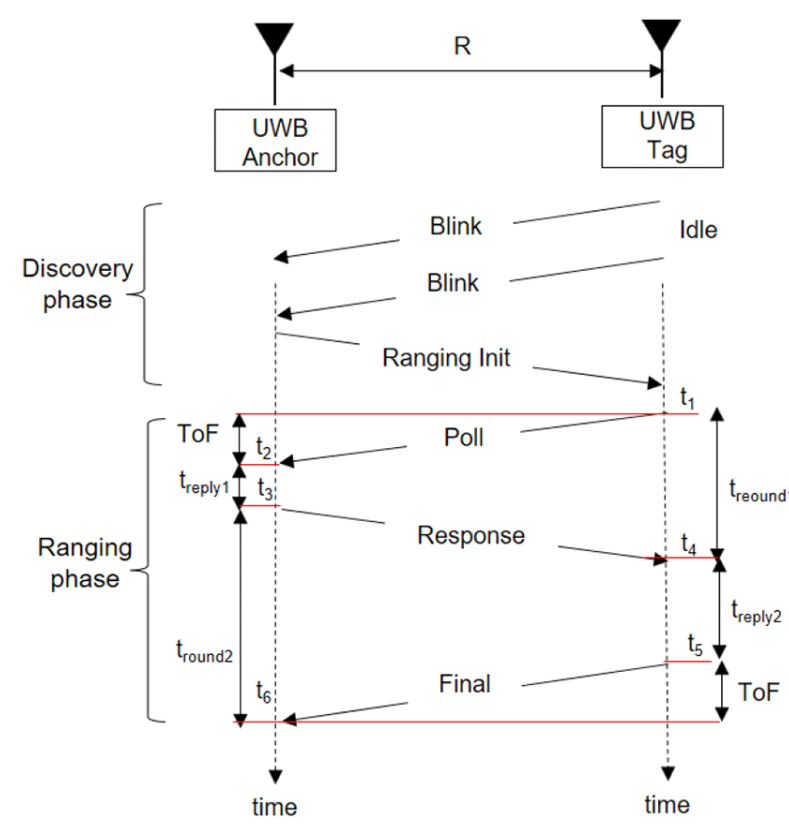
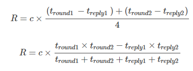
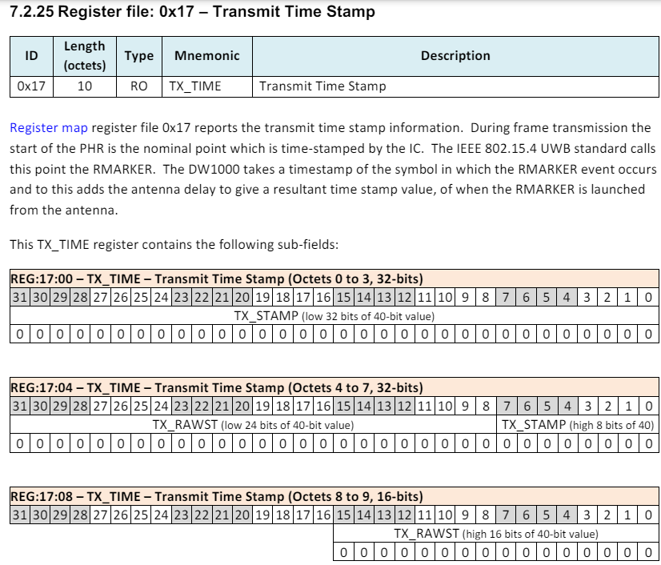
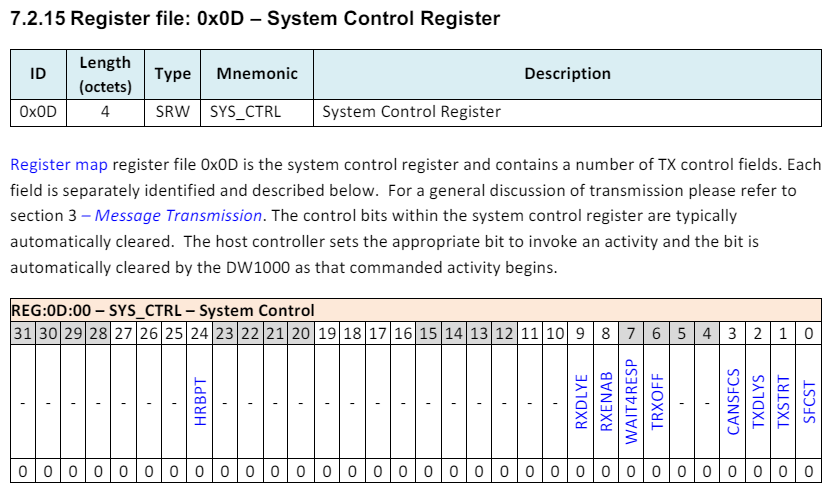
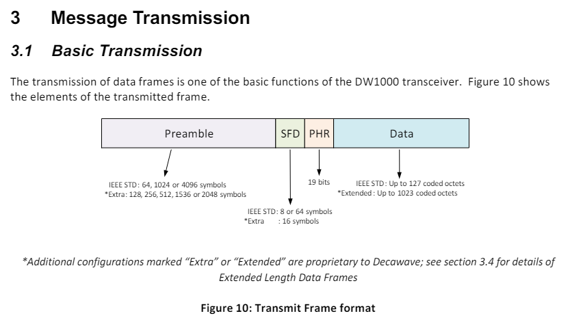

# TIL 04.24

날짜: 2024년 4월 24일

### 일정

---

- ESP32로 우회

- Port : COM5
- Board : ESP 32 Dev Module
    
    

### UWB(Ultra-WideBand) 통신

---

- 3.1 ~ 10.6GHz 사이의 주파수 범위에서 채널당 500MHz의 대역폭을 사용하여 통신하는 무선 통신 기술
    - 국내에서는 기존 무선기기와의 간섭 경감을 위해 7.2 ~ 10.2GHz (8 ~ 14ch)만 사용 가능
- 1ns 이하의 짧은 폭의 Pulse를 넓은 대역에 걸쳐 송수신
- 넓은 대역에서 낮은 진폭으로 전달하기 때문에 소비 전력이 적고, 고속 통신이 가능
- 위치 추정 오차 10cm 이내
    
    
    
    
    
    
- 프로젝트에서는 안내 손잡이(Anchor)와 안내 로봇(Tag) 사이의 거리 측정에 해당 기술을 사용할 예정
- 참조 문헌
    
    [J. Korean Inst. Electromagn. Eng.: Principles and Trends of UWB Positioning Technology](https://www.jkiees.org/archive/view_article?pid=jkiees-33-1-1)
    

### UWB 모듈 (DWM1000)

---

- Qorvo사에서 유통하는 UWB 송수신 모듈
- SPI 인터페이스를 통해 통신 데이터 제공
    
    [Ultra-Wideband - Qorvo](https://www.qorvo.com/products/wireless-connectivity/ultra-wideband#ta0116)
    

- DW1000 user manual 기반으로 소스 코드 개발

### 참고 자료

---

[https://github.com/thotro/arduino-dw1000](https://github.com/thotro/arduino-dw1000)

- arduino 기반 dw1000 사용을 위한 오픈 소스

[https://github.com/F-Army/arduino-dw1000-ng](https://github.com/F-Army/arduino-dw1000-ng)

- ESP32(안내 손잡이)에서 사용할 소스
    
    [DWM1000( UWB통신모듈) 테스트](https://makernambo.com/162)
    
    - 위 사이트를 따라 ESP32에 arduino IDE를 사용하여 구현

### UWB 통신 소스 코드 정리

---

- 위 참고 자료를 기반으로 UWB를 통한 거리 측정 관련 기능 정리

- 코드 구성
    - Anchor
    - Tag
    - module

- 동작 원리
    1. Anchor로 사용되는 모듈과 Tag로 사용되는 모듈로 나뉨
    2. Anchor 모듈에서 신호를 받을 준비
        - Anchor모듈 loop문이 동작하는 과정
            1. 최초 sentAck와 receivedAck의 값이 false일 때, resetInactive()가 동작
                
                ```arduino
                    if (!sentAck && !receivedAck) {
                        // check if inactive
                        if (curMillis - lastActivity > resetPeriod) {
                            resetInactive();
                        }
                        return;
                    }
                ```
                
            2. resetInactive에서 아래 함수 동작
                1. receiver()
                    
                    ```arduino
                    void receiver() {
                        DW1000Ng::forceTRxOff();
                        // so we don't need to restart the receiver manually
                        DW1000Ng::startReceive();
                    }
                    ```
                    
                    - forceTRxOff()
                        
                        ```cpp
                        	void forceTRxOff() {
                        		memset(_sysctrl, 0, LEN_SYS_CTRL);
                        		DW1000NgUtils::setBit(_sysctrl, LEN_SYS_CTRL, TRXOFF_BIT, true);
                        		_writeBytesToRegister(SYS_CTRL, NO_SUB, _sysctrl, LEN_SYS_CTRL);
                        	}
                        ```
                        
                        - SYS_CTRL 레지스터의 TRXOFF_BIT 부분(0x06) true값 입력
                    - startReceive()
                        
                        ```cpp
                        	void startReceive(ReceiveMode mode) {
                        		memset(_sysctrl, 0, LEN_SYS_CTRL);
                        		DW1000NgUtils::setBit(_sysctrl, LEN_SYS_CTRL, SFCST_BIT, !_frameCheck);
                        		if(mode == ReceiveMode::DELAYED)
                        			DW1000NgUtils::setBit(_sysctrl, LEN_SYS_CTRL, RXDLYS_BIT, true);
                        		DW1000NgUtils::setBit(_sysctrl, LEN_SYS_CTRL, RXENAB_BIT, true);
                        		_writeBytesToRegister(SYS_CTRL, NO_SUB, _sysctrl, LEN_SYS_CTRL);
                        	}
                        ```
                        
                        - SYS_CTRL 레지스터의 SFCST_BIT에 frameCheck값 입력 (코드 유효성 검사 FCS를 위한 작업)
                        - 이후 RXENAB_BIT에 true값 입력
                        - RXENAB_BIT가 true로 변경되면 수신기가 활성화되면서 preamble sequence가 수신 되기를 반복하여 탐색
                        - 수신기가 활성화되면 interruptServiceRoutine()이 동작 (왜 동작하는지 모르겠음)
                        - 수신기 활성이 되면서 SYS_STATUS의 RXDFR_BIT가 활성화 되었고, 이에 따라 _isReceiveDone()의 값이 true로 rerturn
                        - ReceiveStatus가 초기화 되면서 _handleReceived 동작
                            - _handleReceived
                                
                                ```cpp
                                	void attachReceivedHandler(void (* handleReceived)(void)) {
                                		_handleReceived = handleReceived;
                                	}
                                ```
                                
                                ```cpp
                                    DW1000Ng::attachReceivedHandler(handleReceived);
                                    
                                    void handleReceived() {
                                    // status change on received success
                                    receivedAck = true;
                                }
                                ```
                                
                                - 위 변수는 콜백 함수인 handleReceived()를 저장하고 있는 멤버 변수였으므로 동작 시 Anchor 모듈의 receivedAck가 true로 변경됨
                    
                    <aside>
                    💡 receiver() 동작 요약
                    
                    1. DWM1000이 수신 대기 상태로 전환
                    2. handleReceived()가 동작하여 ReceivedAck 값이 true로 바뀜
                    </aside>
                    
                2. noteActivity
                    - lastActivity 값 동기화
                    
            3. if(receivedAck)  내부 동작 
                1. receivedAck → false로 변경 (data 못 받을 경우 2번 반복을 위해)
                2. getReceivedData(data, LEN_DATA) 동작
                    
                    ```cpp
                    	void getReceivedData(byte data[], uint16_t n) {
                    		if(n <= 0) {
                    			return;
                    		}
                    		_readBytesFromRegister(RX_BUFFER, NO_SUB, data, n);
                    	}
                    
                    	void getReceivedData(String& data) {
                    		uint16_t i;
                    		uint16_t n = getReceivedDataLength(); // number of bytes w/o the two FCS ones
                    		if(n <= 0) { // TODO
                    			return;
                    		}
                    		byte* dataBytes = (byte*)malloc(n);
                    		getReceivedData(dataBytes, n);
                    		// clear string
                    		data.remove(0);
                    		data  = "";
                    		// append to string
                    		for(i = 0; i < n; i++) {
                    			data += (char)dataBytes[i];
                    		}
                    		free(dataBytes);
                    	}
                    ```
                    
                    - RX_BUFFER에 저장된 data를 읽어서 data에 저장
                3. 받은 data의 0번지 값을 msgId에 저장
                    - msgId가 expectedMsgId와 다를 경우 → protocolFailed → 아무 동작 안함
                    - msgId == POLL → 초기화, 또는 시작했을 때 값
                        - 보낸 시간 (ReceivedTimeStamp)을 저장하고
                        - expectedMsgId를 Range (돌아온 값으로 위치 계산하는 모드)로 변경
                        - 신호 전송 (transmitPollAck)
                            
                            ```cpp
                            void transmitPollAck() {
                                data[0] = POLL_ACK;
                                DW1000Ng::setTransmitData(data, LEN_DATA);
                                DW1000Ng::startTransmit();
                            }
                            ```
                            
                            - setTransmitData
                                
                                ```cpp
                                void setTransmitData(byte data[], uint16_t n) {
                                		if(_frameCheck) {
                                			n += 2; // two bytes CRC-16
                                		}
                                		if(n > LEN_EXT_UWB_FRAMES) {
                                			return; // TODO proper error handling: frame/buffer size
                                		}
                                		if(n > LEN_UWB_FRAMES && !_extendedFrameLength) {
                                			return; // TODO proper error handling: frame/buffer size
                                		}
                                		// transmit data and length
                                		_writeBytesToRegister(TX_BUFFER, NO_SUB, data, n);
                                		
                                		/* Sets up transmit frame control length based on data length */
                                		_txfctrl[0] = (byte)(n & 0xFF); // 1 byte (regular length + 1 bit)
                                		_txfctrl[1] &= 0xE0;
                                		_txfctrl[1] |= (byte)((n >> 8) & 0x03);  // 2 added bits if extended length
                                		_writeTransmitFrameControlRegister();
                                	}
                                ```
                                
                                - data[0]에 POLL_ACK를 담아 전송하면, Tag loop에서 Anchor가 전송한 신호를 받았다고 인식하여 거리감지를 시작함
                                - _txfctrl에 전송할 데이터를 추가
                                    
                                    ```cpp
                                    void _writeTransmitFrameControlRegister() {
                                    			_writeBytesToRegister(TX_FCTRL, NO_SUB, _txfctrl, LEN_TX_FCTRL);
                                    		}
                                    ```
                                    
                                - TX_FCTRL 레지스터에 _txfctrl 저장
                                
                            - startTransmit
                                
                                ```cpp
                                	void startTransmit(TransmitMode mode) {
                                		memset(_sysctrl, 0, LEN_SYS_CTRL);
                                		DW1000NgUtils::setBit(_sysctrl, LEN_SYS_CTRL, SFCST_BIT, !_frameCheck);
                                		if(mode == TransmitMode::DELAYED)
                                			DW1000NgUtils::setBit(_sysctrl, LEN_SYS_CTRL, TXDLYS_BIT, true);
                                		if(_wait4resp)
                                			DW1000NgUtils::setBit(_sysctrl, LEN_SYS_CTRL, WAIT4RESP_BIT, true);
                                
                                		DW1000NgUtils::setBit(_sysctrl, LEN_SYS_CTRL, TXSTRT_BIT, true);
                                		_writeBytesToRegister(SYS_CTRL, NO_SUB, _sysctrl, LEN_SYS_CTRL);
                                	}
                                ```
                                
                                - SYS_CTRL 레지스터의 TX_STRT_BIT 활성화
                                    - 위 레지스터 활성화 즉시 IC에서 프레임 전송을 시작함
                                    - 단, TX_DLYS_BIT가 설정되어 있을 경우 정해진 만큼 지연 후 시작
                                - received와 마찬가지로 전송 성공 시 _handleSent 콜백 (handleSent) 동작에 의해 sentAck → true로 변환
                                    - 전송 성공하면 timePollAckSent 값에 현재 TimeStamp를 저장
                                
                    
    3. Anchor 모듈에서 준비 신호를 전송하면 Tag에서 POLL 신호를 전송
        - Tag 모듈 loop문이 동작하는 과정
            - Tag 모듈은 기본적으로 Anchor 모듈로 계속하여 신호를 전송함
            - Anchor 모듈의 준비 신호를 수신하게 되면 POLL 신호를 Anchor모듈로 전송
            - Anchor 모듈의 POLL_ACK 신호를 수신하게 되면 필요한 시간값을 담아 RANGE 신호를 전송
            - Anchor 모듈의 RANGE_REPORT 신호를 수신하게 되면 현재 위치를 저장하고 다시 POLL 신호를 전송
            
            1. 최초 sentAck와 receivedAck의 값이 false일 때, resetInactive()가 동작 Anchor모듈과 다름
                
                ```cpp
                // 
                void resetInactive() {
                  // tag sends POLL and listens for POLL_ACK
                  expectedMsgId = POLL_ACK;
                  DW1000Ng::forceTRxOff();
                  transmitPoll();
                  noteActivity();
                }
                ```
                
                - TRXOFF_BIT on → 전송 data TX_BUFFER에 저장 → 신호 전송 → sentAck True
            2. if(sentAck)
                
                ```cpp
                  if (sentAck) {
                    sentAck = false;
                    DW1000Ng::startReceive();
                  }
                ```
                
                - RXENAB_BIT on → receivedAck True
            3. if(receivedAck)
                - msgId가 POLL_ACK일 때, 신호를 전송한 시간과 받은 시간을 저장하여 transmitRange() 동작 + 현재 MsgId를 Range_report로 전환
                - Anchor에서 보낸 신호를 받았을 경우 data[0] 이 POLL_ACK 값으로 들어옴
                    
                    ```cpp
                    void transmitRange() {
                      data[0] = RANGE;
                    
                      /* Calculation of future time */
                      byte futureTimeBytes[LENGTH_TIMESTAMP];
                    
                      timeRangeSent = DW1000Ng::getSystemTimestamp();
                      timeRangeSent += DW1000NgTime::microsecondsToUWBTime(replyDelayTimeUS);
                      DW1000NgUtils::writeValueToBytes(futureTimeBytes, timeRangeSent, LENGTH_TIMESTAMP);
                      DW1000Ng::setDelayedTRX(futureTimeBytes);
                      timeRangeSent += DW1000Ng::getTxAntennaDelay();
                    
                      DW1000NgUtils::writeValueToBytes(data + 1, timePollSent, LENGTH_TIMESTAMP);
                      DW1000NgUtils::writeValueToBytes(data + 6, timePollAckReceived, LENGTH_TIMESTAMP);
                      DW1000NgUtils::writeValueToBytes(data + 11, timeRangeSent, LENGTH_TIMESTAMP);
                      DW1000Ng::setTransmitData(data, LEN_DATA);
                      DW1000Ng::startTransmit(TransmitMode::DELAYED);
                      //Serial.print("Expect RANGE to be sent @ "); Serial.println(timeRangeSent.getAsFloat());
                    }
                    ```
                    
                    - getSystemTimestamp : SYS_TIME 레지스터의 값 읽음
                        - SYS_TIME 레지스터 저장 시간
                            - Manual 설명
                                
                                Register map register file 0x06 is the System Time Counter register. System time and time stamps are designed to be based on the time units which are nominally at 64 GHz, or more precisely 499.2 MHz × 128 which is 63.8976 GHz. In line with this when the DW1000 is in idle mode with the digital PLL enabled, the System Time Counter is incremented at a rate of 125 MHz in units of 512. The nine low-order bits of this register are thus always zero. The counter wrap period of the clock is then: 2^40 ÷ (128×499.2e6) = 17.2074
                                seconds.
                                Notes
                                
                                (a) On power up, before the digital PLL is enabled, the System Time Counter increments are still in units of 512 however the increment rate is half the external crystal frequency, (e.g. at 19.2 MHz for the 38.4 MHz crystal). The counter wrap period is then: 231 ÷ 19.2e6 = 111.8481 seconds.
                                (b) In sleep modes the system time counter is disabled and this register is not updated.
                                
                            - 
                    - microsecondsToUWBTime : 미리 선언한 delaytime을 연산하여 timeRangeSent에 추가
                        
                        ```cpp
                        uint16_t replyDelayTimeUS = 3000;
                        
                        // DW1000NgTime.cpp
                        namespace DW1000NgTime {
                            uint64_t microsecondsToUWBTime(uint64_t microSeconds) {
                                return static_cast<uint64_t>(microSeconds * TIME_RES_INV);
                            }
                        }
                        ```
                        
                    - writeValueToBytes : futureTimeBytes에 timeRangeSent값 바이트 단위 저장 → setDelayedTRX : delay시간 DX_TIME 레지스터에 저장
                    - getTxAntennaDelay : _antennaTxDelay값을 timeRangeSent에 추가
                    - writeValueToBytes(data, ~)
                        - data[0] : RANGE
                        - data + 1 : timePollSent - 전송 시점 시간
                        - data + 6 : timePollAckReceived - 수신 시점 시간
                        - data + 11 : timeRangeSent - SYS_TIME + 전송 지연 시간
                    - data 값 저장 한 다음 TX_BUFFER에 저장 후 → SYS_CTRL 레지스터에 TXSTRT_BIT 활성화 → 데이터 전송
                    
                    <aside>
                    💡 transmitRange 요약
                    
                    1. Anchor로 부터 전송 받은 시점에 현재 SYS_TIME과 전송시간, 수신 시간을 data에 담고
                    2. TX_BUFFER에 입력 시킨 다음
                    3. 버퍼에 저장된 data를 전송함
                    </aside>
                    
    4. data[0]가 Range인 신호를 Anchor가 수신 받으면 두 모듈간 거리를 연산하여 출력
        - 신호 수신 및 연산 과정
            - distance 연산을 위해 6가지의 변수를 담아 computeRangeAsymmetric 수행
                
                ```cpp
                timeRangeReceived = DW1000Ng::getReceiveTimestamp();
                
                timePollSent = DW1000NgUtils::bytesAsValue(data + 1, LENGTH_TIMESTAMP);
                timePollAckReceived = DW1000NgUtils::bytesAsValue(data + 6, LENGTH_TIMESTAMP);
                timeRangeSent = DW1000NgUtils::bytesAsValue(data + 11, LENGTH_TIMESTAMP);
                // (re-)compute range as two-way ranging is done
                double distance = DW1000NgRanging::computeRangeAsymmetric(timePollSent,
                                                            timePollReceived, 
                                                            timePollAckSent, 
                                                            timePollAckReceived, 
                                                            timeRangeSent, 
                                                            timeRangeReceived);
                /* Apply simple bias correction */
                distance = DW1000NgRanging::correctRange(distance);
                ```
                
                - timePollSent, timePollAckReceived, timeRangeSent : Tag 모듈에서 측정한 시간값들
                - timePollReceived : Tag에서 전송한 신호를 Anchor에서 받은 시점
                - timePollAckSent : Anchor 모듈에서 Tag로 POLL_ACK신호를 전송한 시점
                - timeRangeReceived : POLL_ACK 신호를 받은 Tag에서 다시 RANGE 신호를 전송하고 Anchor 모듈에서 RANGE 신호를 받은 시점
            - distance 연산
                
                ```cpp
                double computeRangeAsymmetric(   
                                                uint64_t timePollSent,
                                                uint64_t timePollReceived,
                                                uint64_t timePollAckSent,
                                                uint64_t timePollAckReceived,
                                                uint64_t timeRangeSent,
                                                uint64_t timeRangeReceived
                                            )
                {
                    uint32_t timePollSent_32 = static_cast<uint32_t>(timePollSent);
                    uint32_t timePollReceived_32 = static_cast<uint32_t>(timePollReceived);
                    uint32_t timePollAckSent_32 = static_cast<uint32_t>(timePollAckSent);
                    uint32_t timePollAckReceived_32 = static_cast<uint32_t>(timePollAckReceived);
                    uint32_t timeRangeSent_32 = static_cast<uint32_t>(timeRangeSent);
                    uint32_t timeRangeReceived_32 = static_cast<uint32_t>(timeRangeReceived);
                   
                    double round1 = static_cast<double>(timePollAckReceived_32 - timePollSent_32);
                    double reply1 = static_cast<double>(timePollAckSent_32 - timePollReceived_32);
                    double round2 = static_cast<double>(timeRangeReceived_32 - timePollAckSent_32);
                    double reply2 = static_cast<double>(timeRangeSent_32 - timePollAckReceived_32);
                
                    int64_t tof_uwb = static_cast<int64_t>((round1 * round2 - reply1 * reply2) / (round1 + round2 + reply1 + reply2));
                    double distance = tof_uwb * DISTANCE_OF_RADIO;
                
                    return distance;
                }
                ```
                
                
                
                - 위 식과 같이 연산하여 Anchor와 Tag 모듈 사이 거리 값을 반환
                - 주파수에 따른 편향 오차 보정 (뭔지 모르겠음)
                    
                    ```cpp
                    distance = DW1000NgRanging::correctRange(distance);
                    ```
                    
                - RANGE_REPORT 정보를 담은 신호를 Tag 모듈로 전송, 인자에 현재 위치를 담아 보냄
                    
                    ```cpp
                    	/* Speed of radio waves (light) [m/s] * timestamp resolution [~15.65ps] of DW1000Ng */
                    	constexpr float DISTANCE_OF_RADIO     = 0.0046917639786159f;
                    	constexpr float DISTANCE_OF_RADIO_INV = 213.139451293f;
                    
                    void transmitRangeReport(float curRange) {
                        data[0] = RANGE_REPORT;
                        // write final ranging result
                        memcpy(data + 1, &curRange, 4);
                        DW1000Ng::setTransmitData(data, LEN_DATA);
                        DW1000Ng::startTransmit();
                    }
                    
                    transmitRangeReport(distance * DISTANCE_OF_RADIO_INV);
                    ```
                    
                - Tag 모듈에서 RANGE_REPORT를 받으면 현재 위치 값을 저장한 다음 POLL 정보를 담은 신호를 다시 Anchor로 전송함 (위치 확인 1회차 종료)

---

- 소스 코드 정리
    
    ```cpp
    void loop() {
      if (!sentAck && !receivedAck) {
        // check if inactive
        if (millis() - lastActivity > resetPeriod) {
          resetInactive();
        }
        return;
      }
      // continue on any success confirmation
      if (sentAck) {
        sentAck = false;
        DW1000Ng::startReceive();
      }
      if (receivedAck) {
        receivedAck = false;
        // get message and parse
        DW1000Ng::getReceivedData(data, LEN_DATA);
        byte msgId = data[0];
        if (msgId != expectedMsgId) {
          // unexpected message, start over again
          //Serial.print("Received wrong message # "); Serial.println(msgId);
          expectedMsgId = POLL_ACK;
          transmitPoll();
          return;
        }
        if (msgId == POLL_ACK) {
          timePollSent = DW1000Ng::getTransmitTimestamp();
          timePollAckReceived = DW1000Ng::getReceiveTimestamp();
          expectedMsgId = RANGE_REPORT;
          transmitRange();
          noteActivity();
        } else if (msgId == RANGE_REPORT) {
          expectedMsgId = POLL_ACK;
          float curRange;
          memcpy(&curRange, data + 1, 4);
          delay(100);
          transmitPoll();
          noteActivity();
        } else if (msgId == RANGE_FAILED) {
          expectedMsgId = POLL_ACK;
          transmitPoll();
          noteActivity();
        }
      }
    }
    ```
    
    - sentAck
        
        ```cpp
        volatile boolean sentAck = false;
        
        void handleSent() {
          // status change on sent success
          sentAck = true;
        }
        
        // 메시지를 전송하
        
        if (sentAck) {
            sentAck = false;
            DW1000Ng::startReceive();
          }
        ```
        
        - handleSent 동작 시 sentAck → true로 변경
        - sentAck true면 startReceive 수행
            
            ```cpp
            //hpp
            void startReceive(ReceiveMode mode = ReceiveMode::IMMEDIATE);
            
            //cpp
            constexpr uint16_t LEN_SYS_CTRL = 4;
            constexpr uint16_t SFCST_BIT = 0;
            constexpr uint16_t RXENAB_BIT = 8;
            constexpr uint16_t RXDLYS_BIT = 9;
            constexpr uint16_t NO_SUB = 0xFF;
            
            byte       _sysctrl[LEN_SYS_CTRL];
            
            void startReceive(ReceiveMode mode) {
            		memset(_sysctrl, 0, LEN_SYS_CTRL);
            		DW1000NgUtils::setBit(_sysctrl, LEN_SYS_CTRL, SFCST_BIT, !_frameCheck);
            		if(mode == ReceiveMode::DELAYED)
            			DW1000NgUtils::setBit(_sysctrl, LEN_SYS_CTRL, RXDLYS_BIT, true);
            		DW1000NgUtils::setBit(_sysctrl, LEN_SYS_CTRL, RXENAB_BIT, true);
            		_writeBytesToRegister(SYS_CTRL, NO_SUB, _sysctrl, LEN_SYS_CTRL);
            	}
            	
            ```
            
            - setbit
                
                ```cpp
                void setBit(byte data[], uint16_t n, uint16_t bit, boolean val) {
                		uint16_t idx;
                		uint8_t shift;
                		
                		idx = bit/8;
                		if(idx >= n) {
                			return; // TODO proper error handling: out of bounds
                		}
                		byte* targetByte = &data[idx];
                		shift = bit%8;
                		if(val) {
                			bitSet(*targetByte, shift);
                		} else {
                			bitClear(*targetByte, shift);
                		}
                	}
                ```
                
                - data의 target 위치에 bit추가/삭제
                
            - _writeBytesToRegister
                
                ```cpp
                void _writeBytesToRegister(byte cmd, uint16_t offset, byte data[], uint16_t data_size) {
                			byte header[3];
                			uint8_t headerLen = 1;
                			
                			// TODO proper error handling: address out of bounds
                			// build SPI header
                			if(offset == NO_SUB) {
                				header[0] = WRITE | cmd;
                			} else {
                				header[0] = WRITE_SUB | cmd;
                				if(offset < 128) {
                					header[1] = (byte)offset;
                					headerLen++;
                				} else {
                					header[1] = RW_SUB_EXT | (byte)offset;
                					header[2] = (byte)(offset >> 7);
                					headerLen += 2;
                				}
                			}
                			
                			SPIporting::writeToSPI(_ss, headerLen, header, data_size, data);
                		}
                ```
                

- distance 관련
    
    ```cpp
    DW1000Ng::getReceivedData(data, LEN_DATA);
    
    timeRangeReceived = DW1000Ng::getReceiveTimestamp();
          expectedMsgId = POLL;
          if (!protocolFailed) {
              timePollSent = DW1000NgUtils::bytesAsValue(data + 1, LENGTH_TIMESTAMP);
              timePollAckReceived = DW1000NgUtils::bytesAsValue(data + 6, LENGTH_TIMESTAMP);
              timeRangeSent = DW1000NgUtils::bytesAsValue(data + 11, LENGTH_TIMESTAMP);
              // (re-)compute range as two-way ranging is done
              double distance = DW1000NgRanging::computeRangeAsymmetric(timePollSent,
                                                          timePollReceived, 
                                                          timePollAckSent, 
                                                          timePollAckReceived, 
                                                          timeRangeSent, 
                                                          timeRangeReceived);
              /* Apply simple bias correction */
              distance = DW1000NgRanging::correctRange(distance);
    ```
    
    - getReceivedData
        
        ```cpp
        void getReceivedData(byte data[], uint16_t n) {
        		if(n <= 0) {
        			return;
        		}
        		_readBytesFromRegister(RX_BUFFER, NO_SUB, data, n);
        	}
        ```
        
    
    - _readBytesFromRegister
        
        ```cpp
        void _readBytesFromRegister(byte cmd, uint16_t offset, byte data[], uint16_t data_size) {
        			byte header[3];
        			uint8_t headerLen = 1;
        			
        			// build SPI header
        			if(offset == NO_SUB) {
        				header[0] = READ | cmd;
        			} else {
        				header[0] = READ_SUB | cmd;
        				if(offset < 128) {
        					header[1] = (byte)offset;
        					headerLen++;
        				} else {
        					header[1] = RW_SUB_EXT | (byte)offset;
        					header[2] = (byte)(offset >> 7);
        					headerLen += 2;
        				}
        			}
        
        			SPIporting::readFromSPI(_ss, headerLen, header, data_size, data);
        		}
        ```
        
        - cmd 레지스터
        - SPIporting::readFromSPI
            
            ```cpp
            void readFromSPI(uint8_t slaveSelectPIN, uint8_t headerLen, byte header[], uint16_t dataLen, byte data[]){
            		_openSPI(slaveSelectPIN);
            		for(auto i = 0; i < headerLen; i++) {
            			_spi->transfer(header[i]); // send header
            		}
            		for(auto i = 0; i < dataLen; i++) {
            			data[i] = _spi->transfer(0x00); // read values
            		}
            		delayMicroseconds(5);
            		_closeSPI(slaveSelectPIN);
            	}
            ```
            
            - 
    
    - getTransmitTimestamp()
        
        ```cpp
        uint64_t getTransmitTimestamp() {
        		byte data[LENGTH_TIMESTAMP];
        		memset(data, 0 , LENGTH_TIMESTAMP);
        		_readBytesFromRegister(TX_TIME, TX_STAMP_SUB, data, LEN_TX_STAMP);
        		return DW1000NgUtils::bytesAsValue(data, LEN_TX_STAMP);
        	}
        ```
        
        
        
        - TX_TIME (0x17)은 DW1000 모듈의 레지스터 주소
    
    - DW1000NgRanging::computeRangeAsymmetric
        
        ```cpp
        double computeRangeAsymmetric(    
                                            uint64_t timePollSent, // 
                                            uint64_t timePollReceived, 
                                            uint64_t timePollAckSent, 
                                            uint64_t timePollAckReceived,
                                            uint64_t timeRangeSent,
                                            uint64_t timeRangeReceived
                                        )
            {
        			  // 인자 변수 저장
                uint32_t timePollSent_32 = static_cast<uint32_t>(timePollSent);
                uint32_t timePollReceived_32 = static_cast<uint32_t>(timePollReceived);
                uint32_t timePollAckSent_32 = static_cast<uint32_t>(timePollAckSent);
                uint32_t timePollAckReceived_32 = static_cast<uint32_t>(timePollAckReceived);
                uint32_t timeRangeSent_32 = static_cast<uint32_t>(timeRangeSent);
                uint32_t timeRangeReceived_32 = static_cast<uint32_t>(timeRangeReceived);
                
                
                double round1 = static_cast<double>(timePollAckReceived_32 - timePollSent_32);
                double reply1 = static_cast<double>(timePollAckSent_32 - timePollReceived_32);
                double round2 = static_cast<double>(timeRangeReceived_32 - timePollAckSent_32);
                double reply2 = static_cast<double>(timeRangeSent_32 - timePollAckReceived_32);
        
                int64_t tof_uwb = static_cast<int64_t>((round1 * round2 - reply1 * reply2) / (round1 + round2 + reply1 + reply2));
                double distance = tof_uwb * DISTANCE_OF_RADIO;
        
                return distance;
            }
        ```
        

### 주요 레지스터

---

- SYS_CTRL (0x0D)
    
    
    
    - 각 bit의 on/off 상태에 따라 DW1000모듈의 상태를 제어
    
    
    

### 거리 측정

---

- 기준 모듈(Anchor)에서 신호 주기적으로 신호 전송
    - Responder 파일의 loop문에서 resetInactive 동작
    - 현재 MsgId를 POLL 상태로 변경하고 reciever() 동작
        - forceTRxOFF : SYS_CTRL 레지스터에 TRXOFF (0x06)번 비트 true로 변경 (Transmit을 안하겠다)
        - startReceive
            - SFCST_BIT : FCS (Frame Check Sequence)의 추가 여부 결정 (on - 추가 x, off - 추가 o)
            - RXDLYS_BIT : Receive 딜레이 추가 (ReceiveMode - Delayed가 켜졌을 경우 추가)
            - RXENAB_BIT : DW1000 수신기를 켜고 프리앰블 시퀀스 찾기 시작 (명령 후 16us 지연있음)
                - 프리앰블 - Transmit 되는 데이터 프레임의 앞 단 비트