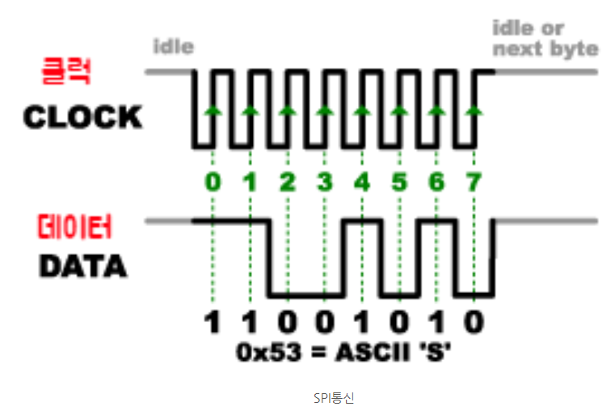
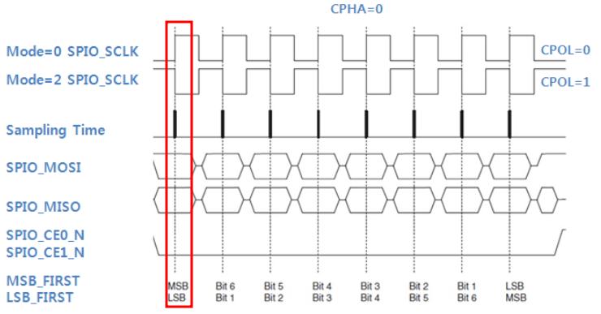
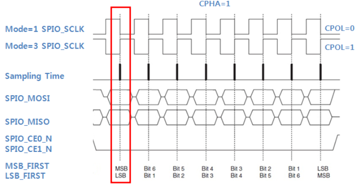
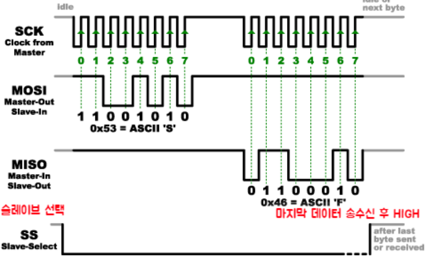
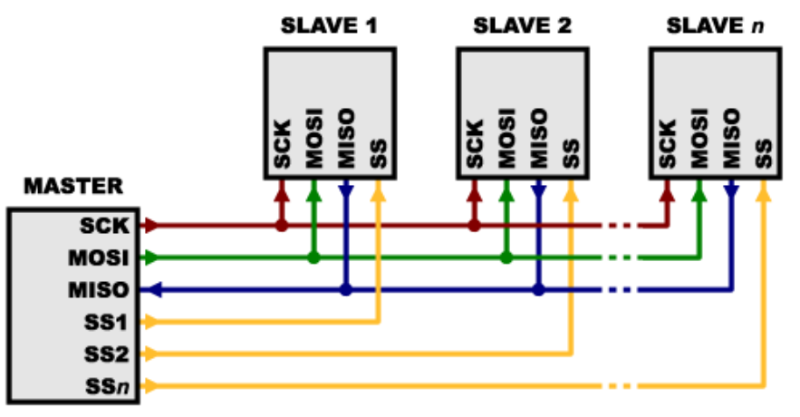

# TIL 04.26

날짜: 2024년 4월 26일

### 라즈베리파이 포팅 순서

---

- Pi OS
    - Rasberry Pi OS (Legacy, 64-bit) release; 2024-03-12
    
- Pi Configuration
    - Interfaces 전부 on
    
- time 설정
    
    ```bash
    sudo ln -sf /usr/share/zoneinfo/Asia/Seoul /etc/localtime
    
    sudo date [현재 시간]
    
    EX.
    sudo date 042610182024.00
    ```
    
- apt 업데이트 및 vim 설치
    
    ```bash
    sudo apt-get update
    sudo apt-get upgrade -y
    sudo apt install vim
    ```
    
- UWB 라이브러리 git clone
    
    ```bash
    git clone https://github.com/pedestrian0423/DW1000_Raspi_Python_library.git
    ```
    

### SPI 통신

---

참조 사이트

[SPI 모드](https://blog.naver.com/msyang59/220667890563)

[SPI 통신에 대하여](https://blog.naver.com/emperonics/221714005614)

- SPI (Serial Peripheral Interface)
    - 동기식 직렬 통신 프로토콜
        - 동기식 : 클럭 신호에 동기화되어 데이터 전송 (클럭은 마스터에서 제공)
        - 직렬 : 데이터는 비트 스트림 형태로 직렬화 되어 전송
        - 양방향 : 마스터 → 슬레이브 / 슬레이브 → 마스터 동시에 전송 가능
    - MCU와 디바이스간 데이터를 주고 받을 때 많이 사용되는 통신 방식
    - 다수의 장치들 사이에 빠른 속도로 데이터를 주고 받을 수 있음
    - 4개의 선으로 통신이 이루어짐
        - MOSI : 마스터에서 슬레이브로 데이터 전송
        - MISO : 슬레이브에서 마스터로 데이터 전송
        - SCLK : 클럭 신호 전송
        - SS : 특정 슬레이브와 통신 활성화를 위한 신호선
            - 이 라인은 연결된 디바이스마다 별도의 라인이 연결됨
            - 기본적으로 HIGH 신호를 전송하다가 데이터를 전달하고자 하는 디바이스의 SS라인만 LOW로 바꾸어 통신함

- 통신 방식
    
    
    
    - SCLK 클럭 신호 선에서 전송하는 HIGH, LOW 반복 신호에 맞춰 데이터를 전송함
    - 데이터를 입력 받는 디바이스 또한, 이 클럭 신호에 맞춰 데이터를 읽음
        - SPI 모드
            - 데이터를 읽는 것은 클럭의 상태가 변화 하는 시점(엣지)에 데이터 라인의 상태를 읽는 것
            - SPI 모드는 전송받는 데이터를 읽는 시점을 정의
            - 클럭의 기본 상태와 샘플링 하는 위치에 따라 mode를 정의함
                
                
                |  | 첫 번째 엣지 | 두 번째 엣지 |
                | --- | --- | --- |
                | LOW | 0 | 1 |
                | HIGH | 2 | 3 |
                - 첫 번째 엣지에서 샘플링하는 경우
                    
                    
                    
                - 두 번째 엣지에서 샘플링하는 경우
                    
                    
                    
                
    
    <aside>
    💡 클럭 신호는 설정된 주파수에 따라 계속 HIGH와 LOW를 반복하는데 어느 시점이 데이터인지 어떻게 아나요?
    
    </aside>
    
    
    
    - SS (Slave-Select)는 각 디바이스마다 1개 라인이 별도로 연결됨
    - 이 라인은 기본적으로 HIGH 신호를 보내다가 해당 디바이스가 데이터를 받는 시점이면 LOW로 변경해주는 것으로 지금 데이터를 읽어라는 신호를 알림
    - 모든 디바이스는 MISO 라인을 공유하고 있기 때문에 각 SS 라인에 동시에 LOW 신호를 보내 데이터 혼선이 발생하는 것을 방지 해야함
        
        <aside>
        💡 MISO 라인이 모두 공유되고 있으면 이상한 값을 보낼 걱정은 없나요?
        
        </aside>
        
        - SS 라인이 HIGH 상태인 디바이스는 물리적으로 분리된 상태가 됨
        - 트라이-스테이트 출력 버퍼를 MISO 라인에 연결하고, SS HIGH 상태일 때 고-임피던스 상태가 되게 설정함
        - 해당 상태는 전기적 저항이 매우 높아져 물리적으로 디바이스가 끊어진 상태와 같이 만들 수 있음
    
- SPI 통신 라인 연결 형태
    
    
    

### SPI 통신 라이브러리 (spidev)

---

```cpp
import spidev
```

- SPI 통신 초기 설정
    
    ```python
    import spidev
    
    spi = spidev.SpiDev()  # SPI 객체 생성
    spi.open(0, 0)         # bus 0, device 0 에 연결
    
    spi.max_speed_hz = 1000000  # 통신 속도 1MHz
    spi.mode = 0b00            # SPI 모드 설정
    
    ```
    

- GPIO 세팅
    
    ```python
    import RPi.GPIO as GPIO
    
    _chipSelect = 8
    
    GPIO.setmode(GPIO.BCM)
    GPIO.setwarnings(False)
    GPIO.setup(_chipSelect, GPIO.OUT)
    GPIO.output(_chipSelect, GPIO.HIGH)
    ```
    
- SPI 신호 전송
    
    ```python
    spi.xfer()
    ```
    

### SPI 통신 in DW1000

---

- DW1000으로 들어오는 SPI 옥텟 트랜잭션은 헤더 옥텟과 데이터 옥텟으로 구성해서 전송
- SPI CSn 핀에 LOW값이 들어가면 그 때 부터 시작, HIGH값이 들어가면 종료
- 즉, LOW값이 된 상태에서 들어오는 첫 번째 옥텟을 헤더 옥텟으로 판단함
- 헤더 옥텟
    - 1 ~ 3개로 구성됨
    - 7번 비트가 0이면 read, 1이면 write
    - 6번 비트는 0, sub옥텟이 있으면 1
    - 5 ~ 0번 비트는 레지스터 주소
    - write 모드면 뒤의 데이터 옥텟을 모두 DW1000의 레지스터 주소에 저장함
    - read 모드면 레지스터 주소에 저장된 값들을 데이터 옥텟에 저장함
- 데이터 옥텟
    - 레지스터 주소에 저장할 값 들어오는 옥텟을 순서대로 0번지 부터 저장
    - read 모드면 0을 보냄
    
- SPI 통신 테스트 코드 (수정 중)
    
    ```python
    import spidev
    import RPi.GPIO as GPIO
    
    spi = spidev.SpiDev()
    spi.open(0,0)
    spi.max_speed_hz = 1000000 # DW1000의 최대 클럭 주파수는 약 125MHz, 안정적인 실험을 위해 1MHz에서 실험
    
    reg_address = 0x04
    _chipSelect = 8
    
    data = [0x02, 0x04, 0x06, 0x08]
    readData = [0,0,0,0]
    # spi interface 규칙
    # 7번 비트는 0 - read, 1 - write
    # 6번 비트는 0
    # 따라서, 5 ~ 0 번 비트 사이에서 레지스터 주소를 입력해야 함 -> 64개 주소 사용 가능 (0x00 ~ 0x3F 사이만 사용 가능)
    
    # 쓰기 명령을 수행할 때, reg_address와 7번 비트 on을 위해 0x80과 or 연산
    # 읽기를 하려면 그냥 보내면 됨
    # write = spi.xfer([reg_address | 0x80, 0x01, 0x23,0x45,0x67])
    
    # print(write)
    GPIO.setmode(GPIO.BCM)
    GPIO.setwarnings(False)
    GPIO.setup(_chipSelect, GPIO.OUT)
    GPIO.output(_chipSelect, GPIO.HIGH)
    
    # cs LOW -> Head 옥텟 xfer -> data 옥텟 xfer -> cs HIGH
    
    # cs LOW
    GPIO.output(_chipSelect, GPIO.LOW)
    
    # head xfer
    spi.xfer([reg_address | 0x80])
    
    # data xfer
    for i in range(0, 4):
        spi.xfer([data[i]])
    
    # cs HIGH
    GPIO.output(_chipSelect, GPIO.HIGH)
    
    print("Writing Complete!\n")
    
    GPIO.output(_chipSelect, GPIO.LOW)
    
    spi.xfer([int(reg_address)])
    
    for i in range(0, 4):
        readData[i] = spi.xfer([0x00])
    
    GPIO.output(_chipSelect, GPIO.HIGH)
    
    print("reading Complete\n")
    
    for i in readData:
        print(i)
    ```
    

### 에러 디버깅

---

- 라즈베리파이4 보드의 Chip Select핀은 spidev 라이브러리가 사용할 수 없어 Select 핀을 다른 GPIO핀에 할당하고 수동 조작해줘야 함