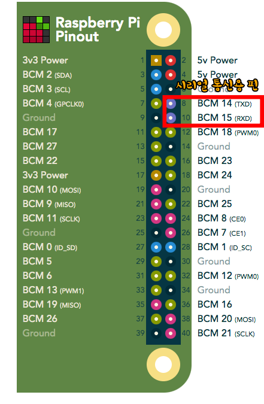
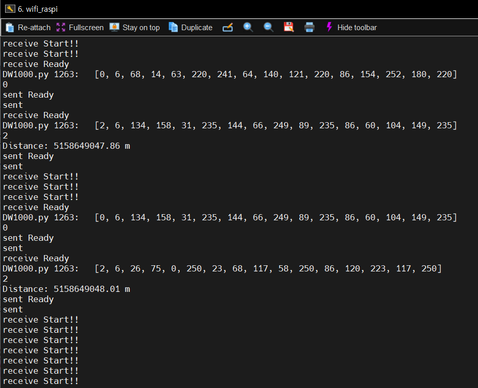
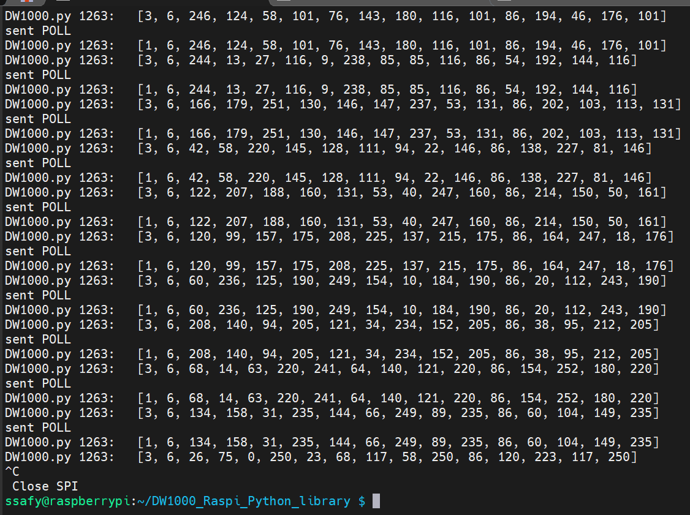

# TIL 04.29

날짜: 2024년 4월 29일

### 일정

---

- UWB 통신 개발 완료

### UWB

---

- 배선 변경
    
    
    - DWM1000 - Rpi4 매핑
        
        
        | DWM1000 | Raspberry Pi |
        | --- | --- |
        | CLK | GPIO11 |
        | MISO | GPIO9 |
        | MOSI | GPIO10 |
        | CSN | GPIO16 |
        | RESET | GPIO23 |
        | IRQ | GPIO19 |
        | VCC | D17 |
        | GND | D9 |
        
    
    
    
- 메인 라이브러리 코드 및 Tag, Anchor 코드 개발 완료

- getbit 에러
    
    ```python
    Traceback (most recent call last):
      File "/home/ssafy/DW1000_Raspi_Python_library/DW1000.py", line 155, in handleInterrupt
        msgReceived = self.getBit(self._sysstatus, 5, C.RXFCG_BIT)
      File "/home/ssafy/DW1000_Raspi_Python_library/DW1000.py", line 1471, in getBit
        data[idx] = (data[idx] >> shift) & 0x01
    
    ```
    
    - 오류 부분 함수 (변경 전)
        
        ```python
        def getBit(self, data, n, pos):
                """
                This function gets the value of a bit in an array of bytes.
        
                Args:
                        data: The array you want to get the bit from.
                        n: The number of bytes in the array.
                        pos: The position of the bit to get.
        
                Returns:
                        The bit in the array according to the position.
                """
                idx = pos / 8
                if idx >= n:
                    return
                shift = pos % 8
                data[idx] = (data[idx] >> shift) & 0x01
                return data[idx]
        ```
        
        - pos 인자는 data 인자로 받아온 레지스터의 원하는 bit 위치를 뜻 함
        - 해당 에러는 handdleInterrupt가 걸렸을 때, SYS_STATUS(0x0F) 레지스터의 RXCFG_BIT (14번 비트)를 msgReceived에 저장하는 동작
            - RXCFG_BIT는 RX_ENABLE 비트 활성화로 인해 모듈 내 수신기가 활성화 되면서 입력받는 프레임에 대한 CRC 체크를 수행 → 프레임의 CRC 체크에 문제가 없으면 Frame Check Sequence가 정상(Good) 임을 자동으로 RXCFG_BIT에 반환함
            - 정상일 경우 해당 비트의 값은 0으로 출력
        - 위 에러는 pos / 8 연산에서 파이썬의 ‘/’ 연산은 나눗셈한 값을 그대로 반환하기 때문에 float 형으로 반환함
            
            ```python
            idx = pos // 8 # 로 변경 필요
            '''
            위 연산이 가지는 의미
            pos는 해당 레지스터에서 출력하고자 하는 비트의 번지
            레지스터의 값은 8bit 단위로 data라는 list형에 저장되어 왔기 때문에 8bit 단위로 인덱스를 1 상승 시키고
            각 data[idx] 안에서 shift (pos % 8)로 구한 값만큼 쉬프트하여 AND 연산 취한 값이 해당 비트가 가진 값
            '''
            ```
            
        
- Tag 모듈 테스트
    - 라즈베리파이3 사용
        - OS : 라즈베리 OS regacy 32bit
        - Tag, Anchor 정상 동작 확인 완료
    
    - 테스트 화면
        - Anchor
            
            
            
            - 출력 값 (DW1000.getData(self, datalength))
                
                ```python
                    def getData(self, datalength):
                        """
                        This function reads a number of bytes in the RX buffer register, stores it into an array and return it.
                
                        Args:
                                datalength = The number of bytes you want to read from the rx buffer.
                
                        Returns:
                                The data read in the RX buffer as an array byte.
                        """
                        data = [0] * datalength
                        time.sleep(0.000005)
                        data = self.readBytes(C.RX_BUFFER, C.NO_SUB, data, datalength)
                        print ("DW1000.py 1263:\t ", data)
                        return data
                ```
                
                - LEN_DATA = 16 고정
                - RX_BUFFER에 수신하여 저장한 값을 data 변수에 넣고 반환 함
                - Tag 측에서 데이터를 받고 msgId를 RANGE(=2)로 전달할 때, data 내부에 거리 측정에 필요한 변수 3종을 전달함
        
        - Tag
            
            
            
        - 데이터 수신 여부 확인 완료

- distance 측정을 위한 코드 수정 예정