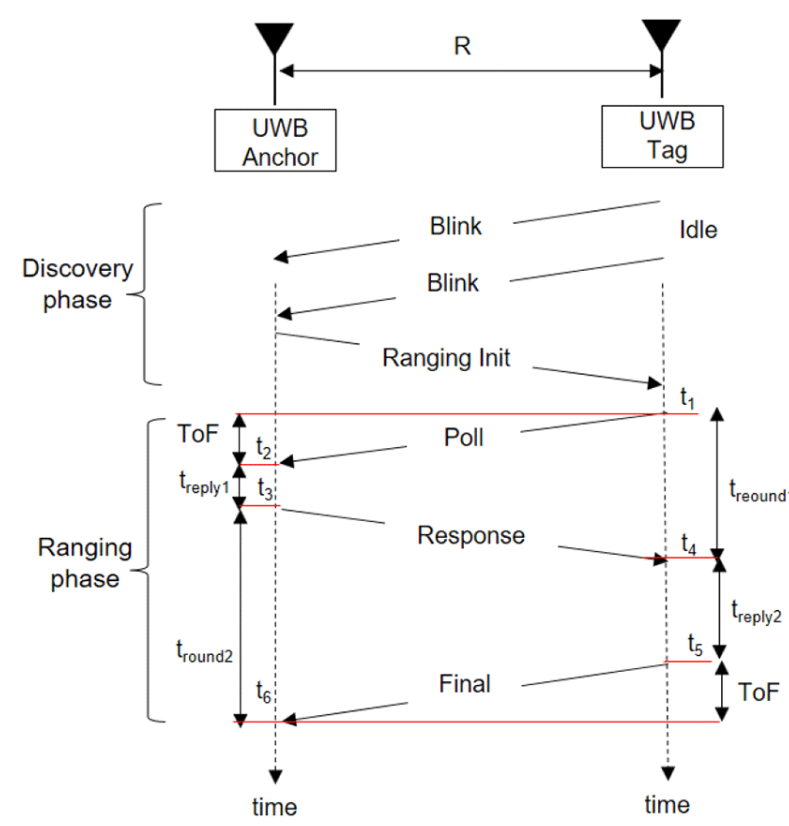

# UWB 거리 측정 개선

날짜: 2024년 4월 30일

### UWB 거리 측정 방식

---

### Message ID

- POLL = 0
- POLL_ACK = 1
- RANGE = 2
- RANGE_REPORT = 3
- BLINK = 4
- RANGING_INIT = 5
- RANGING_FAILED = 255

- Anchor
    - 기준이 되는 모듈
    - Tag로 부터 신호를 받지 않으면 반복해서 수신 대기를 반복
    - Tag에서 수신을 받으면 RX_BUFFER에 기록된 값을 읽어와 data 변수에 저장
    - data[0]에는 Message ID를 저장
    - 모든 Message ID는 expected ID와 같을 때만 정상 동작
        - 메시지를 수신 받고 연산을 처리하는 동안에도 Tag에서는 계속 신호를 보내기 때문에 처리 시간 동안 무시를 위해 비교
        - 잘못된 신호를 받았을 때, 예외 처리
    - 수신 받는 index
        - POLL
            - Tag에서 지속적으로 보내는 Tagging 메시지
            - 이 메시지를 수신 받으면 POLL_ACK 메시지를 Tag에 전달
            - 수신 받은 시점을 timePollReceivedTS에 저장
            

### 손잡이 - 로봇 통신 mode 세팅

---

- mode
    - 요약
        
        
        | SFD_MODE | Standard |
        | --- | --- |
        | Channel | 5 |
        | Data_Rate | 6.8Mbps |
        | Pulse_Frequency(PRF) | 16MHz |
        | Preamble_Length | 64 |
        | Preamble_code | 4 |
    - SFD_MODE : standard
        - SFD (Start of Frame Delimiter) : 프리앰블이 종료되고 페이로드가 시작되는 시작 부분을 정의하는 비트
        - CHAN_CTRL(0x1F) 레지스터의 DWSFD(17, DW1000 SFD), TNSSFD(20, Transmit Non-Standard SFD), RNSSFD(21, Receive Non-Standard SFD) 설정
        - 6.8Mbps 기준 standard mode를 권장
        
        
        
        Table 21: Recommended SFD sequence configurations for best performance
        
    - Channel : 5
        - 낮은 채널에서 넓은 범위를 제공 (??)
    - Data_rate : 6.8Mbps
        
        
        
        - Data_rate가 높을 수록 전송 속도가 빨라짐
        - 낮을 수록 전송 가능 거리가 멀어짐
            - 6.8Mbps = 60m
            - 110Kbps = 250m
        - 전송하는 데이터가 따로 없기 때문에 6.8Mbps 선택
        - 
    
    - Pulse_Frequency : 16MHz
        - 16MHz / 64MHz 두가지 옵션이 있으며, 64MHz가 높은 정확도를 제공, 전력을 많이 소모
        - 두가지 옵션 테스트 후 16MHz에서 만족할 수준의 정확도를 보이면 16MHz / 정확도가 너무 낮으면 64MHz 사용
        
    - Preamble_Length : 64
        
        
        
        - 프리앰블이 길수록 범위 성능 향상 / 타임스탬프 정확성에 큰 영향을 미침
        - 짧은 범위를 전송할 때는 작아도 괜찮음
        
    - Preamble_code : 4
        
        
        
        - 채널과 PRF 따라 적합한 코드 선택