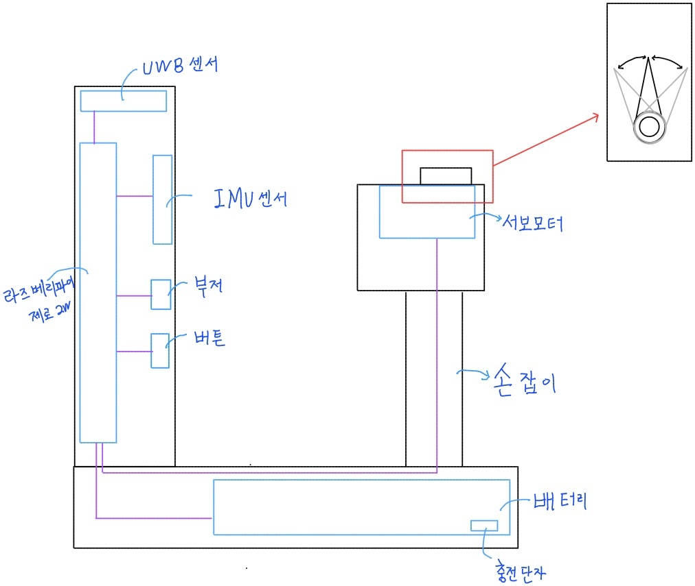

# 중간 발표

# 발표 안내

## 발표

- 일요일까지 팀장채널에 발표자 및 발표 자료 공유
- 발표 시간은 약 15분 (12분 발표 + Q&A 3분)

## 평가 기준

- 주제/아이디어
- 기획/설계

# 발표 내용 정리

## 주제: 실내 시각 장애인 안내 서비스

### 서비스명 정할 필요가 있음.

- 컨셉은 로봇이 먼저 목적지까지 이동을 하면서 사용자에게 따라오라고 알려주는 것임

## 배경

- [https://www.chosun.com/economy/science/2021/04/06/DAHNW43RSBBFRPOIXUR6VMTNWM/](https://www.chosun.com/economy/science/2021/04/06/DAHNW43RSBBFRPOIXUR6VMTNWM/)
    - 안내견 훈련에 많은 시간, 비용 소모

## 기획

### 아이디어 참고

- **모두의 드리블 캠페인**
    
    [https://www.youtube.com/watch?v=EgFnEuPyQZU](https://www.youtube.com/watch?v=EgFnEuPyQZU)
    
    [dminus1.com](http://dminus1.com/work/모두의-드리블-캠페인/)
    
    - 영상 요약: 디마이너스원(DMINUS ONE)에서 거동이 불편한 휠체어 이용자들이 K리그 축구장에 입장할 수 있는 방안은 제안
    
    ⇒ 시각 장애인 또한 평탄한 길을 가는 것이 부상의 위험을 줄일 수 있다는 점에서 동일하다고 판단함. 다만, 어느 경로로 가야 하는지에 대한 정보는 얻기 어려움.
    

### 비교 모델

- [https://www.chosun.com/economy/science/2021/04/06/DAHNW43RSBBFRPOIXUR6VMTNWM/](https://www.chosun.com/economy/science/2021/04/06/DAHNW43RSBBFRPOIXUR6VMTNWM/)
    - 안내 로봇을 통해 SW만을 올리면 훈련 과정 제거를 통해 훈련 비용 최소화
    - 안내견은 안전한 보행 보조만을 수행하지만 로봇은 다양한 목적지로 데려가도록 하는 것이 가능 (/w 여러 센서들)

## 설계

### 안내 로봇

1. 사전 세팅 단계
    1. IMU 센서를 활용하여 실시간으로 로봇의 현재 좌표를 추정 - 시간에 따라 누적되는 오차 보정 필요(칼만 필터, UWB 활용 등)
    2. lidar 센서를 활용하여 실내 지도 제작
2. 목적지 입력
    1. 사용자가 입력한 목적지 정보 수신
3. 안내
    1. 실내 지도 정보를 기반으로 목적지까지의 경로 생성
    2. 사용자 앞에서 경로를 따라 자율 주행
    3. 사용자의 위치를 판단하여 사용자에게 올바른 진행 방향 전달 및 일정 간격 유지
4. 장애물 인지/정지 명령
    1. 카메라를 활용하여 전방에 사람이나 장애물 인지/판단 후 충돌 방지
    2. 사용자가 정지 명령을 보내면 일시 정지 후 대기
5. 도착
    1. 사용자에게 도착 신호 전달

### 안내 손잡이

아이디어는 2단계로 진행하였음.

시각장애인의 지팡이에서 아이디어를 얻었음.

본 프로젝트에서 지팡이로 직접 길을 찾는 방법이 아닌 방향을 지시하는 목적을 가진 “안내 기기”를 만든다.

“안내 기기”는 “안내 로봇”의 정보를 송/수신한다.

“안내 기기”에서는 판단 알고리즘이 없다. 그저 센서의 값을 읽거나, 모듈의 동작을 쓸 뿐이다. 

### 1안

---

### 2안

---

### 사용하는 디바이스

- Raspberry Pi zero 2w (BLE - bluetooth low energy 내장)
- IMU (MPU9250)
- UWB (DWM1000)
- Servo motor (MG996R)
- 2차 리튬 이온 배터리 (18650)
- 부저
- 버튼
- PowerBoost 1000 Charger

### 디바이스로 뭐 하는데

- Rasberry pi zero 2W는 일반적인 라즈베리파이 보드보다 작으며, 내장된 wifi와 bluetooth가 있다. 일반적인 라즈베리파이 보드의 GPIO 핀 배치가 동일하다. 프로세서는 A53을 사용하므로 라즈베리파이 3B의 A57보다 성능은 좋지 않음. 따라서 대부분의 연산은 jetson nano로 이동해야함.
- 블루투스 연결; Bluetuooth 4.2이다. BLE로 저전력이다. jetson Nano에게 정보를 송/수신 하는데 사용하는 프로토콜이다.
- MPU9250 센서는 라즈베리파이와 I2C interface로 연결된다. MPU9250은 9축 가속, 자이로, 지자기를 센싱한다. 우리는 여기서 자이로 센서를 이용해서 현재 사용자가 어느 방향을 바라 보고 있는지를 파악한다. 이 정보는 블루투스를 통해 “안내 로봇”에게 전달한다.
- BWM1000은 라즈베리파이의 SPI interface로 연결된다. 2개 이상의 UWB 모듈들이 통신에 걸리는 시간을 기반으로 거리를 감지하는 모듈이다. (서로 transmitt, receive한다, 역할 구분은 없다) “안내 로봇”과 “안내 기기”의 거리를 파악한다. 다만, “안내 로봇”도 UWB를 가지기 때문에 블루투스를 통해 정보를 “안내 로봇”에게 전달할 필요는 없다.
- MG996R은 라즈베리파이와 PWM로 연결된다. (PWM 핀에 연결하는 것으로 interface는 아님, 이라고 해도 GPIO일듯) duty cycle을 20[ms]로 요구하기 때문에 50[Hz]로 신호 주기를 맞춰야 한다. 이 주기에서 1~2[ms]의 HIGH신호로 0º~180º로 각도 조정이 가능하다..
이 조정된 각도는 사용자에게 “어느 방향으로 이동하라”를 알려준다. 제대로된 경로를 0º를 기준으로 좌 -90º에서 우 +90º를 가진다. 만약, -90º를 초과한 경우 -90º를 사용자가 회전해도 남은 회전 각도가 남아있게 한다.
- 18650과 PowerBoost 1000 Charger은 라즈베리파이의 구동 전원을 담당한다. 특히 PowerBoost 1000 Charger는 충전 단자를 제공하므로 18650의 충전이 가능케 한다. 18650은 2000~3500mAh이 있다. 예상되는 가동 시간은 최대 30분으로 예상된다.
- 부저는 PWM으로 연결된다. 앞의 장애물이 있는 경우(갑자기 사람이 달려 옴 있음), 상황과 그 상황에 맞는 신호음의 신호 방법은 정해야함. 단일 음(262 == 도)으로 하는게 좋을듯함
- 버튼은 GPIO의 인터럽트 방식으로 해야한다. 사용자가 이동을 멈춰야 하는 경우를 대비해 만들었음. toggle방식으로 진행하겠음

### 개발 예상도

python으로 빠르게 기능을 만들고, 모든 기능을 통합해 실제 테스트를 해본다.

하나씩 C언어로 바꾸며, UWB의 경우, SPI interface를 이용해서 라이브러리 개발의 어려움이 있다. C언어에서 python 모듈을 불러오는 방법을 생각하자.

