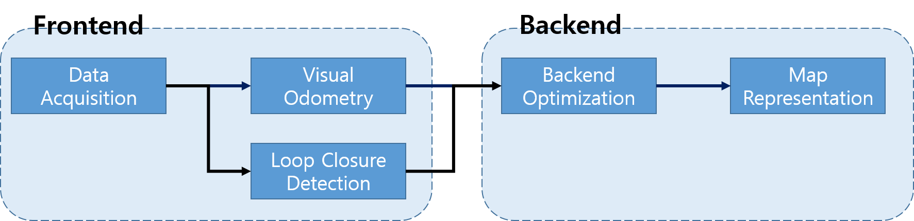

# VSLAM
## SLAM 이란?
Simultaneous Localization And Mapping의 약어.
- "내가 어디에 있지?"(Localization) + "내 주변에 뭐가 있지?"(Mapping) 를 동시에 풀고자 하는 방법

## SLAM 종류
### Bayes 필터 기반
- ex) EKF SLAM, Fast SLAM
1. 다음 2개의 입력값을 받는다.
    - 현재 위치에 대한 예측값
    - 랜드마크의 위치에 대한 측정값
2. 각각의 사전확률이 Likelihood와 결합
3. 로봇의 현재 위치와 랜드마크의 위치에 대한 사후 확률 업데이트

### Graph 구조를 이용한 최적화에 기반
- 궤적을 Graph로 표현하고 제약 조건을 만족하는 형태로 최적화하는 방법
    - Node: 위치
    - Edge: 두 노드 사이의 제약 조건 (회전과 이동)

### Feature based Method (or Indirect Method)
- 영상에서 특징점을 기반으로 카메라 궤적을 추적하고 매핑을 수행하는 방법
- ex) ORB-SLAM

### Direct Method
- 영상 간의 밝기(Intensity) 값 차이를 직접 이용해 카메라의 궤적을 추적하고 매핑을 수행하는 직접 기반 방법
- ex) LSD SLAM

### 딥러닝 기술
- 각 프레임마다 CNN을 기반으로 특징점을 추출하고 연속된 특징점을 RNN으로 매핑을 수행하는 방법
- ex) DeepVO
- 정확도는 낮지만, 비지도 혹은 반지도 학습을 적용하는 방안으로 연구가 되기도 함.

## SLAM Pipeline
- Frontend와 Backend로 구성됨.

### Visual Odometry
- 두 영상 사이의 충분한 겹침이 있다면, 형상에서 특징점을 추출하고 특징점 간의 대응 관계를 활용하여 상대적인 움직임 파라미터를 계산
- 누적된 Drift Error(표류오차) 때문에 실제 궤적과 차이가 있음.
    $\rightarrow$ [루프 폐쇄 검출](#loop-closure-detection)과 [백엔드 최적화](Backend Optimization) 필요

### Loop Closure Detection
- 현재 센서 위치가 이전에 방문한 곳인지 판단하는 알고리즘
- 현재 입력 센서와 이전 입력 센서의 유사성을 고려하여 판단
    * 이미지 간의 유사성: 다양한 변화 요인들(날씨, 시간 등)에 따른 유사성 판단 필요
    * 기하학적 구조의 유사성
- [백엔드 최적화](백엔드 최적화) 단계에서 추가적인 제약 조건을 부여하고 누적된 표류 오차를 제거하여 전역적으로 일관될 지도  생성

### Backend Optimization
- 노이즈가 많은 데이터로부터 전체 시스템의 상태를 정확하게 추정하는 방법
- 필터 기반 방법과 비선형 최적화 기반 방법이 존재함.
- 필터 기반 방법
    - [Bayes Filter](#bayes-필터-기반)를 이용하여 재귀적으로 사전확률과 가능도를 융합하여 사후확률을 업데이트 하며 센서의 자세 또는 랜드마크의 위치를 업데이트 해나가는 방법 
    - ex) Kalman filter, Particle filter
- 비선형 최적화 기반 방법
    - 센서의 자세와 랜드마크 사이에 비선형적인 관측 모델이나 연속적인 센서 사이의 비선형적 움직임 모델이 주어졌을 때, 이러한 비선형 모델에 의해 만들어지는 제약조건(Constraint)을 최소화 시키는 방향으로 센서의 자세와 랜드마크를 업데이트해 나가는 방법
    - ex) Bundle adjustment, Graph optimization

### Map Representation
- 최적화된 센서의 자세와 랜드마크의 자세를 이용하여 환경 맵을 만드는 과정