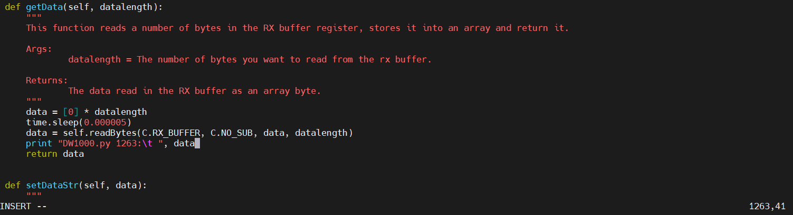

# 손잡이 개발 문서

작성자: 김영래
2
## 목록
### 1. 모듈 사용 예시 코드 및 핀 배치도
    - 1.1. IMU (MPU6050 / MPU 9250)
    - 1.2. UWB(DWM 1000)
    - 1.3. 서보모터 (MG996R)
    - 1.4. 블루투스 통신
    - 1.5. 버튼
    - 1.6. 부저
    - 1.7. 멀티 쓰레딩

### 2. UWB 질문


## 1. 모듈 사용 예시 코드 및 핀 배치도
### 1.1. IMU (MPU6050 / MPU 9250)
---
Interface: I2C

PIN: 

비고: 실제 사용은 MPU 9250이나 현재 없는 관계로 MPU 6050으로 대체하겠음

### 1.2. UWB(DWM 1000)
---
Interface: SPI

PIN: 

비고: python Library로 진행중이나 막힘이 있음
GPIO를 BCM으로(BOARD말고) 핀 세팅한건 SPI1.0 인데 코드는 SPI0.0을 기준으로 하고 있음.

이 부분의 오류점이 있어서 좀 더 시도해 보아야함.


### 1.3. 서보모터(MG996R)
---
Interface: PWM

PIN: VCC - 5V, GND - GND, PWM - 12(BCM 18)


[그림 1 - 서보모터 핀 배치]

비고: 


참고자료: https://blog.naver.com/chandong83/221850060160

코드: 
```python
import RPi.GPIO as GPIO
from time import sleep

servoPin          = 12
SERVO_MAX_DUTY    = 12
SERVO_MIN_DUTY    = 3

GPIO.setmode(GPIO.BOARD) # 핀 번호를 BCM으로 하고 싶다면 GPIO.setmode(GPIO.BCM)
GPIO.setup(servoPin, GPIO.OUT)

servo = GPIO.PWM(servoPin, 50)
servo.start(0)


def setServoPos(degree):
  if degree > 180:
    degree = 180

  duty = SERVO_MIN_DUTY+(degree*(SERVO_MAX_DUTY-SERVO_MIN_DUTY)/180.0)
  print("Degree: {} to {}(Duty)".format(degree, duty))

  servo.ChangeDutyCycle(duty)


if __name__ == "__main__":
  setServoPos(0)
  sleep(1)
  setServoPos(45)
  sleep(1)

  setServoPos(90)
  sleep(1)


  setServoPos(135)
  sleep(1)

  setServoPos(180)
  sleep(1)


  servo.stop()

  GPIO.cleanup()
```


### 1.4. 블루투스 통신
---
Interface: 없음

PIN: 없음

비고: Bluetooth 4.2 (BLE)


### 1.5. 버튼
Interface: GPIO

PIN: 


비고: 인터럽트 사용


### 1.6. 부저
---
Interface: PWM

PIN: GND - GND, PWM - 12(BCM 18)


[그림 2 - 부저 사진]

비고: 

참고자료: https://rasino.tistory.com/entry/%E3%80%90%EB%9D%BC%EC%A6%88%EB%B2%A0%EB%A6%ACPi20%E3%80%91-%ED%94%BC%EC%97%90%EC%A1%B0-%EB%B6%80%EC%A0%80-%EC%82%AC%EC%9A%A9%ED%95%98%EA%B8%B0-with-%ED%8C%8C%EC%9D%B4%EC%8D%AC-%EC%BD%94%EB%93%9C

코드: 
```python
import RPi.GPIO as GPIO
import time


buzzer = 12
GPIO.setmode(GPIO.BOARD)
GPIO.setup(buzzer, GPIO.OUT)
GPIO.setwarnings(False)
pwm = GPIO.PWM(buzzer, 262)


if __name__ == "__main__":
    pwm.start(50.0)
    time.sleep(0.5)
    pwm.stop()

    GPIO.cleanup()
```


### 1.7. 멀티 쓰레딩
---
Interface: 없음

PIN: 없음

비고: 

예제코드1: task1 과 task2로 1, 2초마다 print하는 코드


<br><br>


예저코드2: task1을 수행하고 task2를 호출(join) 후 exit


현재 https://github.com/pedestrian0423/DW1000_Raspi_Python_library 에서 파이썬 라이브러리를 가져와서 라즈베리파이 4B 환경에서 테스트 중이다. 월요일부터 목요일까지 진행했으나 성공하지 못해서 모듈 개발자에게 질문을 할 내용을 작성하도록 하겠다.

작성된 내용은 ISSUE로 질문하고,
stack overflow에도 게시할 예정임.


__UWB Question__
---


__Greetings__
---
Hello, I am a student currently taking an embedded course in an educational program called "Samsung Youth SW Academy".

Project wants to use DWM1000 to measure the distance between two nodes via UWB.
(The two nodes are finally ESP32 and Jetson Nano, but they are currently working with two Raspberry Pi 4B for testing.)

I'm trying to use this library, but I have an issue, so I'm asking you some questions.


__Current Development Environment__
---
```
Node 1

Raspberry Pi 4B
Python 3.9.2
Rasberry Pi OS (Legacy, 64-bit) release; 2024-03-12
DWM1000


Node 2

Jetson Nano model-B
Python 3.8.10
Ubuntu 20.04
DWM1000
```

Ubuntu 20.04 release; https://qengineering.eu/install-ubuntu-20.04-on-jetson-nano.html

Currently, we would like to use 'Example/DW1000RangingAnchor.py ' and 'Example/DW1000RangingTAG.py ' provided to measure the distance between the two nodes.


__final purpose__
---
Measuring the Distance Between Two Nodes via DWM1000


__Some questions in the code__
---
I have two questions from the library you provided.


[Picture 100]

Looking at the code on DW1000.py , it seems to be writing SPI0,0.

```python
def begin(self, irq, rst=None, bus=None, device=None):
  self._bus = 0
  self._device = 0
```


[Picture 101]


[Picture 102]

However, if you look at the code on DW1000RangingAnchor.py , the SPI you use appears to be SPI1,0.

Q1. I wonder if the pin connection in the code you provided is "SPI0,0" or "SPI1,0".

```python
# SPI0,0
# DWM1000           RPi
# MOSI              19 (BCM 10)
# MISO              21 (BCM 9)
# CLK               23 (BCM 11)
# CSN               24 (BCM 8)


# SPI1,0
# DWM1000           RPi
# MOSI              38 (BCM 20)
# MISO              35 (BCM 19)
# CLK               40 (BCM 21)
# CSN               36 (BCM 16)
```
Q2. Is it correct that you designated MISO pin as irq pin?

```python3
PIN_IRQ = 19
```

In the code(or script?), by BCM, number 19 appears to be the MISO of SPI1.

If the MISO pin is designated as irq pin, does the IRQ pin of DWM1000 have no connection?

Q3. Do you use the RSTN pin for DW1000?


[Picture 103]

If You use it, at DW1000RangingAnchor.py

```python
# Before
DW1000.begin(PIN_IRQ)

# After
PIN_RST = 23 # 16 (BCM 23)

DW1000.begin(PIN_IRQ, PIN_RST) 
```
Can I change it like this?


__The process that has been done__
---
__Pre-processing__
---

[Picture 01]

I completed the git clone and copied the example files in Sample to the directory where the "DW1000.py " file was located.


[Picture 02]

```shell
$ python3 DW1000RangingAnchor.py
```

RUN DW1000RangingAnchor.py

As shown in [Photo 2], there was no () in the function print in "DW1000.py "


[Picture 03]


[Picture 04]

I added the part without () in Line:48 in [Photo 3] and Line:1263 in [Photo 4].

```python
# DW1000.py

# Line:48
# Before
print self.spi
# After
print (self.spi)

# Line:1263
# Before
print "DW1000.py 1263:\t ", data
# After
print ("DW1000.py 1263:\t ", data)
```

And

I used module time instead of module monotonic.

So there are changes at DW1000RangingAnchor.py and DW1000RangingTAG.py.

```python
# Before
import monotonic
...
return int(round(monotonic.monotonic() * C.MILLISECONDS))

# After
import time
...
return int(round(time.monotonic() * C.MILLISECONDS))
```

Just in case, I installed monotonic.

```shell
$ pip3 install monotonic
```
__Edit DW1000RangingAnchor.py__
---


[Picture 05]

```
$ python3 DW1000RangingAnchor.py
```

An error like [Photo 5] comes up after executing the above command.

I looked at DW1000RangingAnchor.py .


[Picture 06]


[Picture 07]


[Picture 08]

In the code, it seems to be used by the class itself, not by the instance.

```python
def transmitPollAck(),
def transmitRangeAcknowledge(),
def transmitRangeFailed(),
def receiver(),
def computeRangeAsymetric(),
def loop(),
try,
except 
```

The above modules use DW1000.moduleName() method.


[Picture 09]

So I declared it as an instance first.

```python
dw1000 = DW1000.DW1000()
```
And


[Picture 10]

```python
transmitPollAck(),
transmitRangeAcknowledge(),
transmitRangeFailed(),
receiver(),
try,
except 
```

Changed the above modules.

```python
# Before
DW1000.modulename()

# After
dw1000.modulename()


# A global variable was added within each module using instance dw1000.
global dw1000

```

__Edit DW1000RangingTAG.py__
---

Modify DW1000RangingTAG.py like DW1000RangingAnchor.py .

- dw1000 = DW1000.DW1000()
- DW1000.module() -> dw1000.module()
- global dw1000  (For modules using dw1000 only)


__Edit DW1000.py__
---

Excute DW1000RangingTAG.py and DW1000RangingAnchor.py again


[Picture 11]


[Picture 12]

Errors like [Photo 11] and [Photo 12] come up.

I will revise DW1000.py more.

Go to Line:84 on DW1000.py .

Self._irq seems to be a problem because it's None, not Integer.


[Picture 13]

I modified it as shown in [Photo 13].

```shell
$ python3 DW1000RangingAnchor.py
```

I executed the above code.


[Picture 14]

"None" is right.

Let's put the irq pin as a direct integer. (I designated BCM 18 on the assumption that the irq pin is not a MISO pin.)


[Picture 15]

I ran it.
[Photo 15]
I wrote self._irq = 18. I wrote self._irq == 18 wrong.


[Picture 16]

I solved it from the bottom TypeError.


[Picture 17]

```python
# Before
idx = bit / 8

# After
idx = bit // 8
```

as if to seek one's share and the rest
Instead of the '/' operator where the float is returned, i used '//' where the int is returned.

This is the result of running DW1000RangingAnchor.py and DW1000RanginTAG.py .


[Picture 18]


[Picture 19]

__Question__
---
Through the above process, we proceeded to [Figure 18] and [Figure 19].

Q3. Is the current output a valid output?

Like Device ID and Unique ID, most of them are zero

In reality, what price should come out,
I wonder if any output has no additional output other than photos.


Q4. Are the files you use for distance measurement DW1000RangingAnchor.py and DW1000RanginTAG.py ?


Q5. Is it possible to measure the distance between Raspberry Pi (Or Jetson Nano Ubuntu 20.04; Python 3.8.10) and ESP32 using that library?

The DWM1000 library for ESP32 was imported from https://github.com/F-Army/arduino-dw1000-ng .


Q6. Is there a way to check if the DWM1000 module and Raspberry Pi have a normal SPI connection?

To verify that the current DWM1000 module and Raspberry Pi are connected successfully, we modified the readBytesOTP() function on DW1000.py .


[Picture 20]

```python
print("Read readBytesOTP's return data")
for i_data in data:
  print(i_data)

return data
```

Thinking SPI0,0,0, the MISO pin was not irq and irq was designated as BCM 18.

I didn't modify the rst.

In this process, as shown in [Photo 22], duplicate errors occur.


[Picture 21]


[Picture 22]

```python
# DW1000.py
# def begin()

# before
def begin():

  GPIO.add_event_detect(self._irq, GPIO.RISING, callback=self.handleInterrupt)

# After
event_add_cnt = 0

def begin():
  global event_add_cnt

  if event_add_cnt == 0:
    GPIO.add_event_detect(self._irq, GPIO.RISING, callback=self.handleInterrupt)
    event_add_cnt = 1
```

I modified the code.

```shell
$ python3 DW1000RangingAnchor.py
```

The above command was executed.


[Picture 23]

[Picture 23] It comes out like this.

Is this output normal?

If the output is not normal, how should I fix it?

And is it correct to use the readBytesOTP() function in DW1000.py to check if the SPI is connected normally?


<br><br><br><br><br>


__UWB Question 한국어 버전__
---
거주지가 한국이라 혹시 몰라 한국어로도 질문을 남깁니다.


__인삿말__
---
안녕하세요. 현재 "삼성 청년 SW 아카데미"라는 교육 프로그램에서 임베디드 과정을 수강 중인 학생입니다.

프로젝트에서 UWB를 통한 두 노드간 거리 측정을 위해 DWM1000을 사용하려 합니다.
(두 노드는 최종적으로는 ESP32와 Jetson Nano이나, 현재 테스트를 위해 2대의 라즈베리파이 4B로 진행 중입니다.)

본 라이브러리를 사용하려고 하는데 이슈가 생겨 질문 드립니다.


__현재 개발 환경__

```
Node 1

Raspberry Pi 4B
Python 3.9.2
Rasberry Pi OS (Legacy, 64-bit) release; 2024-03-12
DWM1000


Node 2

Jetson Nano model-B
Python 3.8.10
Ubuntu 20.04
DWM1000
```

Ubuntu 20.04 release; https://qengineering.eu/install-ubuntu-20.04-on-jetson-nano.html

현재 두 노드 간 거리 측정을 위해 제공해주신 'Example/DW1000RangingAnchor.py'와 'Example/DW1000RangingTAG.py'를 사용하려 합니다.


__최종 목적__
---
DWM1000을 통한 두 노드간 거리 측정


__코드에서 궁금한 점__
---
제공해주신 라이브러리에서 궁금한 점이 2개 있습니다.


[사진 100]

DW1000.py의 코드를 보면 SPI0,0을 쓰는 것으로 보입니다.

```python
def begin(self, irq, rst=None, bus=None, device=None):
  self._bus = 0
  self._device = 0
```


[사진 101]


[사진 102]

하지만 DW1000RangingAnchor.py의 코드를 보면 사용하는 SPI는 SPI1,0으로 보입니다. 

Q1. 제공해주신 코드에서 pin 연결은 "SPI0,0"인지 "SPI1,0"인지 궁금합니다.
```python
# SPI0,0
# DWM1000           RPi
# MOSI              19 (BCM 10)
# MISO              21 (BCM 9)
# CLK               23 (BCM 11)
# CSN               24 (BCM 8)


# SPI1,0
# DWM1000           RPi
# MOSI              38 (BCM 20)
# MISO              35 (BCM 19)
# CLK               40 (BCM 21)
# CSN               36 (BCM 16)
```

Q2. MISO pin을 irq pin으로 지정한게 맞습니까?
```python3
PIN_IRQ = 19
```
코드에선 BCM기준으로 19번은 SPI1의 MISO로 보입니다.

만약 MISO pin을 irq pin으로 지정한게 맞다면, DWM1000의 IRQ pin은 연결이 없습니까?

Q3. DW1000의 RSTN pin은 사용하지 않습니까?


[사진 103]

만약 사용한다면, DW1000RangingAnchor.py에서 

```python
# Before
DW1000.begin(PIN_IRQ)

# After
PIN_RST = 23 # 16 (BCM 23)

DW1000.begin(PIN_IRQ, PIN_RST) 
```
으로 변경하면 됩니까?

__현재까지의 진행__
---
__전처리__
---


[사진 1]

git clone을 완료하고 Example에 있는 예제 파일들을 "DW1000.py" 파일이 있는 디렉토리에 카피했습니다.


[사진 2]

```shell
$ python3 DW1000RangingAnchor.py
```

DW1000RangingAnchor.py를 실행함

[사진 2]와 같이 "DW1000.py"에서 함수 print에 ()가 없었음


[사진 3]


[사진 4]

[사진 3]의 Line:48과 [사진 4]의 Line:1263에서 ()가 없는 부분을 추가했습니다.

```python
# DW1000.py

# Line:48
# Before
print self.spi
# After
print (self.spi)

# Line:1263
# Before
print "DW1000.py 1263:\t ", data
# After
print ("DW1000.py 1263:\t ", data)
```


그리고 

모듈 monotonic 대신 time을 사용했습니다.

그래서 DW1000RangingAnchor.py와 DW1000RangingTAG.py 에서 변경이 있습니다.

```python
# Before
import monotonic
...
return int(round(monotonic.monotonic() * C.MILLISECONDS))

# After
import time
...
return int(round(time.monotonic() * C.MILLISECONDS))
```

혹시 몰라 monotonic을 설치했습니다. 
```shell
$ pip3 install monotonic
```
을 했습니다.


__DW1000RangingAnchor.py 편집__
---


[사진 05]

```
$ python3 DW1000RangingAnchor.py
```
위 명령어를 실행하면 [사진 5]와 같은 오류가 나온다.

DW1000RangingAnchor.py 를 살펴보았다.


[사진 06]


[사진 07]


[사진 08]

인스턴스가 아닌 클래스 자체로 사용하고 있었다.

transmitPollAck(),
transmitRangeAcknowledge(),
transmitRangeFailed(),
receiver(),
computeRangeAsymetric(),
loop(),
try,
except 
위 모듈들에서 DW1000.moduleName() 방식으로 사용한다. 


[사진 09]

그래서 먼저 인스턴스로 선언하였다.

```python
dw1000 = DW1000.DW1000()
```


그리고


[사진 10]

```python
transmitPollAck(),
transmitRangeAcknowledge(),
transmitRangeFailed(),
receiver(),
try,
except 
```

위 모듈들을 바꾸었다.

```python
# Before
DW1000.modulename()

# After
dw1000.modulename()


# global 변수로 인스턴스 dw1000을 사용하는 각 module안에 추가했다.
global dw1000

```

__DW1000RangingTAG.py 수정__
---
DW1000RangingTAG.py를 DW1000RangingAnchor.py처럼 수정한다.
- dw1000 = DW1000.DW1000()
- DW1000.module() -> dw1000.module()
- global dw1000  (dw1000을 사용하는 모듈에 한하여)


__DW1000.py 수정__
---
이제 다시 DW1000RangingTAG.py와 DW1000RangingAnchor.py를 실행해보자


[사진 11]


[사진 12]

[사진 11]과 [사진 12]와 같은 오류가 나온다.

DW1000.py를 더 수정하겠다.

DW1000.py의 Line:84로 이동한다.

self._irq가 integer가 아닌 None이라 문제인듯 하다.


[사진 13]

[사진 13]과 같이 수정했다.

```shell
$ python3 DW1000RangingAnchor.py
```

위 코드 실행했다.


[사진 14]

None이 맞다.

irq 핀을 직접 정수로 넣자. (irq핀이 MISO핀이 아니라는 가정하에 BCM 18로 지정했습니다.)


[사진 15]

실행했습니다.
[사진 15]에서 
self._irq = 18로 했습니다. self._irq == 18는 잘못 적은 것입니다.


[사진 16]

맨 아래 TypeError부터 해결했습니다.


[사진 17]

```python
# Before
idx = bit / 8

# After
idx = bit // 8
```
몫과 나머지를 구하는 듯 하여
float가 반환되는 '/'연산자 대신 int가 반환되는 '//' 을 사용했습니다.

DW1000RangingAnchor.py와 DW1000RanginTAG.py를 실행한 결과 입니다.


[사진 18]


[사진 19]

__질문__
---
위 과정을 통해 [그림 18]과 [그림 19]까지 진행했습니다.

Q3. 현재 출력값이 올바른 출력입니까?

Device ID나 Unique ID와 같이 대부분이 0으로 되어있는데 

실제로는 어떤 값이 나와야 하고, 
아무런 출력이 사진 이외에 추가적인 출력이 없는게 맞는지 궁금합니다.


Q4. 거리 측정을 위해 사용하는 파일이 DW1000RangingAnchor.py와 DW1000RanginTAG.py 맞습니까?


Q5. 해당 라이브러리를 사용한 라즈베리파이(Or Jetson Nano Ubuntu20.04; Python3.8.10)와 ESP32의 거리 측정이 가능한가요? 

ESP32의 DWM1000 라이브러리는 https://github.com/F-Army/arduino-dw1000-ng 에서 가져왔습니다.


Q6. DWM1000모듈과 라즈베리파이가 정상적으로 SPI연결이 되었는지 확인하는 방법이 있나요?

현재 DWM1000모듈과 라즈베리파이가 정상적으로 연결이 되었는지 확인하기 위해 DW1000.py의 readBytesOTP()함수를 수정했습니다.


[사진 20]

```python
print("Read readBytesOTP's return data")
for i_data in data:
  print(i_data)

return data
```

SPI0,0으로 생각하고, MISO핀이 irq가 아니며 BCM 18로 irq를 지정했다.

rst는 수정 안 했습니다.

이 과정에서 [사진 22]에 보이듯, 중복 오류가 생긴다.


[사진 21]


[사진 22]


```python
# DW1000.py
# def begin()

# before
def begin():

  GPIO.add_event_detect(self._irq, GPIO.RISING, callback=self.handleInterrupt)

# After
event_add_cnt = 0

def begin():
  global event_add_cnt

  if event_add_cnt == 0:
    GPIO.add_event_detect(self._irq, GPIO.RISING, callback=self.handleInterrupt)
    event_add_cnt = 1
```

코드를 수정했다.

```shell
$ python3 DW1000RangingAnchor.py
```
위 명령어를 실행했다.


[사진 23]

[사진 23]처럼 나온다.

이 출력이 정상이 맞나요?

만약 출력이 정상이 아니라면, 어떻게 수정해야 할까요?

그리고 DW1000.py의 readBytesOTP()함수를 사용해서 SPI가 정상적으로 연결이 되었는지 확인을 하는게 맞나요?

