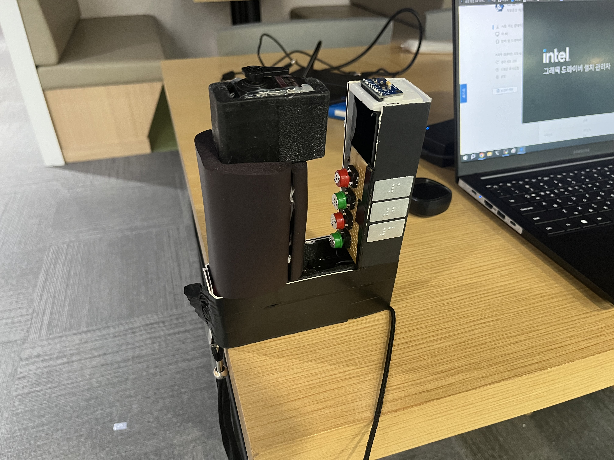
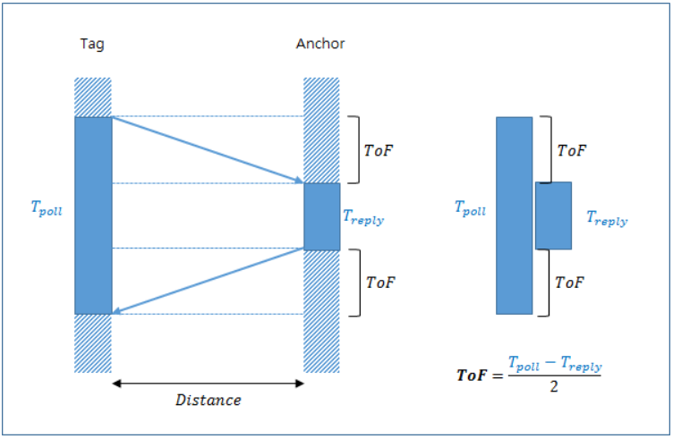
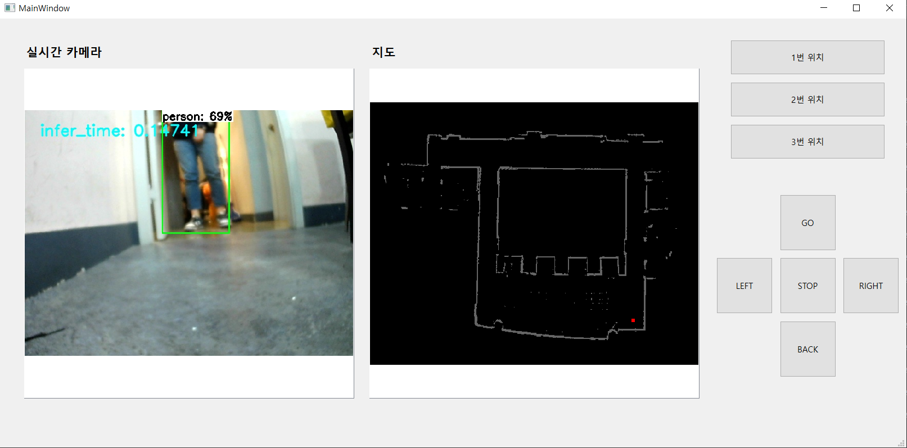
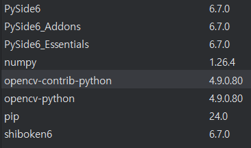

# Handle / Administrator
Author: 김영래, 김태환

Date(Latest): 2024-05-22

요약: 시각장애인을 위한 손잡이(조작기) SW 개발 및 관리자 페이지 개발 

## 모든 하드웨어 정리

보드: ESP32 (풀네임: ESP WROOM-32) 3개

UWB(DWM1000), IMU(MPU9250), Servo motor(MG996R), Button(없음)

## 기술 스택(SW)
```
RTOS: FreeRTOS
WatchDog
Json <-> String Parsing
Bluetooth
PWM (Phase Width Modulation)
Qt (PySide6)
ROS2
기타 임베디드 스킬(GPIO, Interrupt, Uart, I2C, SPI 등등)
```


# 폴더 구조
```
├─ESP_UWB_STR_WATCHDOG
├─img
├─Initator
├─ros2_ws
│  ├─build
│  │  └─(생략)
│  ├─install
│  │  └─map_draw
│  │      ├─(생략)
│  ├─log
│  │  ├─(생략)
│  └─src
│      └─map_draw
│          ├─map_draw
│          ├─resource
│          └─test
└─TotalCode_STR
```
- ESP_UWB_STR_WATCHDOG: UWB Tag폴더 (UWB로 부터 distance 계산 + 손잡이 ESP32로 uart)
- Initator: UWB Anchor 폴더
- img: ReadMe용 이미지 폴더
- ros2_ws: 관리자 페이지 (Qt + ROS2) 폴더
- TotalCode_STR: 손잡이의 ESP32 폴더


# Handle




## 기술 정리 및 설명

### 거리 측정

---

하드웨어는 UWB(DWM1000)을 사용함.
ESP32를 3개 사용합니다. (편의상 甲, 乙, 丙라 하겠음)

甲과乙은 손잡이에, 丙은 로봇에 있습니다.

甲과 丙에는 DWM1000을 SPI연결을 합니다. 
甲의 DWM1000이 Tag가 됩니다.
丙의 DWM1000이 Anchor가 됩니다.





그림과 같이 **전자기파**의 이동시간을 통해 거리를 측정합니다.

甲과 乙을 UART로 연결합니다.

甲 → 乙로 distance값을 전달합니다.

multi tasking을 이용해 uart의 메세지 큐의 가장 최신 distance 값을 가져옵니다.

(uart통신의 수신은 인터럽트를 사용하기 힘듭니다. RX pin을 인터럽트로 받기 때문에 bit마다 인터럽트가 발생합니다. 따라서 인터럽트 오버플로우가 발생할 가능성이 큽니다)

사용한 라이브러리의 한계(가끔 Anchor의 Respond가 정상적이지 않아 무한루프가 되는 이슈가 있음)로 **WatchDog**를 사용했습니다.
**WatchDog**은 **FreeRTOS**의 기능으로 Task가 정상 작동하는지 감시하는 기능입니다. (***ESP***-***IDF FreeRTOS*** is a ***FreeRTOS*** implementation based on Vanilla ***FreeRTOS*** v10.5.1)
WatchDog은 일종의 타이머(Timer)로 타겟 Task에 N초 이상 타이머 Reset을 하지 않으면(N초 → 0초로 줄어듭니다. 타이머를 Reset하면 다시 N초가 됩니다) 보드 자체를 Reset합니다.

### 사용자 속도, 방향 측정


MPU9250(IMU)에는 9축(gyro, acc, mag)의 값을 I2C 통신으로 값을 읽어옵니다.
우리는 이 값들을 입력으로 Madgwick(매드윅)필터를 거쳐 사용자의 위치 변화를 예측합니다.

乙과 연결됩니다.

FreeRTOS의 Multi-Tasking을 이용해 주기적으로 변화를 측정합니다.

측정된 값들은 로봇에게 블루투스로 전달합니다.

### 목적지 입력


乙의 GPIO와 버튼을 연결합니다.

乙의 GND와 버튼의 반대쪽 핀을 연결합니다.

ESP32의 내부 PULL-UP(저항)모드를 이용해 회로를 간단하게 구성합니다.

인터럽트로 눌림을 감지합니다.

 

### 이동방향 안내


시각장애인에게 진행할 방향에 대해 안내하기 위해 서보모터(MG996R)의 각도를 제어합니다.
MG996R를 위한 PWM(펄스 폭 변조)신호의 동작 주기인 20us에서 듀티사이클을 조작해 각도를 제어합니다.

각도는 로봇으로 부터 블.루투스로 0~180의 정수값으로 받아옵니다.

### 통신 (Bluetooth)


ESP32에는 블루투스 4.2 모듈(BLE-Bluetooth Low Energy 아님)이 내장되어 있습니다.

乙의 블루투스 모듈을 이용해, 로봇(Jetson nano)의 ac-8265 모듈과 통신합니다.

통신에는 송신과 수신이 있습니다. 

Json포맷을 String으로 변경해서 송신합니다. Json의 끝을 알리기 위해 ‘@’을 문자열을 전부 보내고 추가로 보냅니다. (’{’와 ‘}’의 갯수 비교보다 훨씬 간단함)

수신도 마찬가지로 ‘@’를 기준으로 문자열의 끝을 판단합니다.

수신은 인터럽트 방식을 사용하는데, UART와 달리 byte단위로 인터럽트가 걸리기 때문에 문제가 없습니다. (물론, 상대측의 송신이 매우 빠르면 수용 가능한 인터럽트 중첩 수보다 많아져서 보드가 reset됩니다)

‘@’를 만나면 수신한 문자열을 Json으로 파싱하고, 전역변수를 업데이트하는 Task에게 Semaphore를 Give합니다.

(Semaphore를 사용하는 이유; Task는 multi tasking이기 때문에 일정 시간마다 읽는데 문자열을 다 받기 전에 읽으면 위험하다. 즉, 동기화를 해야만 한다. 이 동기화를 위해 Semaphore를 사용한다.) (Take와 Give가 있다. 만약 semaphore가 없는데 Take하면, 누군가 semaphore를 Give할 때 까지 대기한다.)

(일상 생활의 예시: 배고픈 나라의 밀가루 제분과 빵 굽기. 배고픈 나라에서 사람들에게 빵을 만들고자 한다. 밀가루 제분과 빵 굽기를 해야하는데 두 일을 동시에 하지 못하며, 최대한 빨리 배고픔을 해소시키기 위해 빵 굽는게 더 우선시 된다. 하지만 밀가루가 없으면 빵을 못 만든다. 이런 경우 세마포를 사용한다)

송신과 수신은 둘 다 멀티 태스킹을 이용한다.

### FreeRTOS를 사용하는 이유


기존의 절차지향 코드는 우선순위와 상관없이 앞의 내용을 끝내야 뒷 내용을 진행하는데, 이러면 일의 우선도에 상관없이 진행된다.
이러면 정작 중요한 일을 해야할 시기에 다른 작업들을 다 해야한다.

이를 위해 FreeRTOS를 사용하는데, 각 Task마다 우선순위를 지정해 우선순위가 높은 Task를 먼저 수행하도록 한다.

### 인터럽트를 사용하는 이유


더 빠른 반응을 위해, 더 적은 리소스 사용을 위해 사용한다.

만약 인터럽트를 사용하지 않으면 버튼을 눌렀는지 계속 지켜보고 있어야 한다. (이를 폴링 방식이라 한다) 이는 매우 비효율적이며, 계속 지켜보고 있어야 하기 때문에 다른 작업을 수행하지 못하고, 멀티태스킹을 이용한다고 해도, 정작 지켜보는 태스크가 수행을 안 하고 있으면 놓친다.

<br><br><br><br><br><br><br><br><br><br>

# 관리자 페이지(Qt,PySide6 + ROS2)




구입 후 초반에 관리자가 쉽게 맵핑이 가능하도록 만든 원격조작 툴이다.


## Setting 과정(Qt, PySide6)


파이참을 설치한다. (파이썬이 자동으로 설치되며, 가상환경도 스스로 만든다.)

설정으로 간다.  (File > Setting > Project: pythonProject > Python Interpreter)

+버튼을 눌러서 패키지를 설치한다.



이제 UI를 만든다.

pythonProject위치 > .venv > Lib > Scripts > pyside6-designer.exe를 실행하고, 원하는 UI를 배치한다.

필요한 인터럽트도 마저 설정한다.

```bash
Project> .\.venv\Scripts\pyside6-uic.exe .\mainUI.ui -o .\mainUI.py
```

위 명령어를 통해 파이썬 코드로 변경한다.

아래 main.py의 기본 코드를 이용해 개발을 진행한다.

```python
import cv2
import numpy as np
import random
from PySide6.QtWidgets import *
from PySide6.QtGui import QPixmap, QImage, QColor
from mainUI import Ui_MainWindow
from PySide6.QtCore import Qt, QSize, QRectF

class MyApp(QMainWindow, Ui_MainWindow):
    def __init__(self):
        super().__init__()
        self.setupUi(self)
        self.main()

    def main(self):
        pass

if __name__ == '__main__':
    app = QApplication()
    win = MyApp()
    win.show()
    app.exec()
```

## Setting 과정(ROS2)

아무 폴더 위치에서 아래 지시사항을 수행한다.

```python
1. ros2_ws 폴더 만들기
2. ros2_ws 폴더 들어가기
3. src 폴더 만들기
4. call C:\dev\ros2_eloquent\setup.bat (이건 터미널 새로 켤때마다 해야함)
5. ros2 pkg create --build-type ament_python 폴더명 (나는 qqt로 함 -> 소문자로 꿈 qqt)
6. qqt를 두번 들어간다. (같은 이름이 두번 있음)
7. pip install PySide6 (없어서 했음)
8. qqt를 두번 들어가면 __init__.py가 있는데, 여기에 내 파이썬 Qt파일(main.py, mainUI.py)을 복사한다. 
9. src/qqt에 있는 setup.py에서 
entry_points={
        'console_scripts': [
            'talker1 = qqt.main:main',
            'talker2 = qqt.Ui_MainWindow:main',
        ],
    },

// 맨 마지막은 무조건 main이 되도록

10. ros2_ws 폴더로 이동한다.
11. colcon build
12. call C:\Users\SSAFY\ros2_ws\install\local_setup.bat
13. ros2 run qqt talker1
```

```bash
pip install PySide6
pip install opencv-contrib-python
pip install opencv-python
```

## 조작


사진 예정

위 사진처럼 왼쪽에 카메라 사진, 오른쪽에 맵의 사진을 띄운다.

두 사진은 ROS2 통신으로 Topic을 Subscribe하여 가져온다. 

카메라는 RGB, 맵은 GreyScale이 되도록 전처리 과정을 진행한다.

Qt의 키보드(또는 버튼)의 인터럽트를 이용하여 Twist값을 Publish한다. 이를 통해 로봇의 조작이 가능케 한다.

### Qt 맵 생성 프로그램 설치 매뉴얼

---

- 사전 환경 세팅
    - SSAFY에서 제공한 개발환경 구축 매뉴얼에 따라 ROS 설치 및 환경 세팅 필요
    - 추가로 파이썬 라이브러리 설치 필요
        
        ```powershell
        pip install PySide6
        pip install opencv-python
        ```
        

1. ros2_ws2.zip 압축파일을 푼다.
2. ros2_ws2 폴더 내에 Qt_setup.bat 파일을 실행한다.
    - Qt_setup.bat 명령어
        
        ```powershell
        call C:\dev\ros2-eloquent\setup.bat
        colcon build
        call install\local_setup.bat
        ```
        
        - 만약 ros2 설치 위치가 다르다면 cmd창을 열고 본인이 설치한 ros2 설치 위치의 setup.bat 파일을 call해야 함
3. Qt_start.bat파일을 실행한다.
    - Qt_start.bat 명령어
        
        ```powershell
        call C:\dev\ros2-eloquent\setup.bat
        call install\local_setup.bat
        ros2 run map_draw app1
        ```